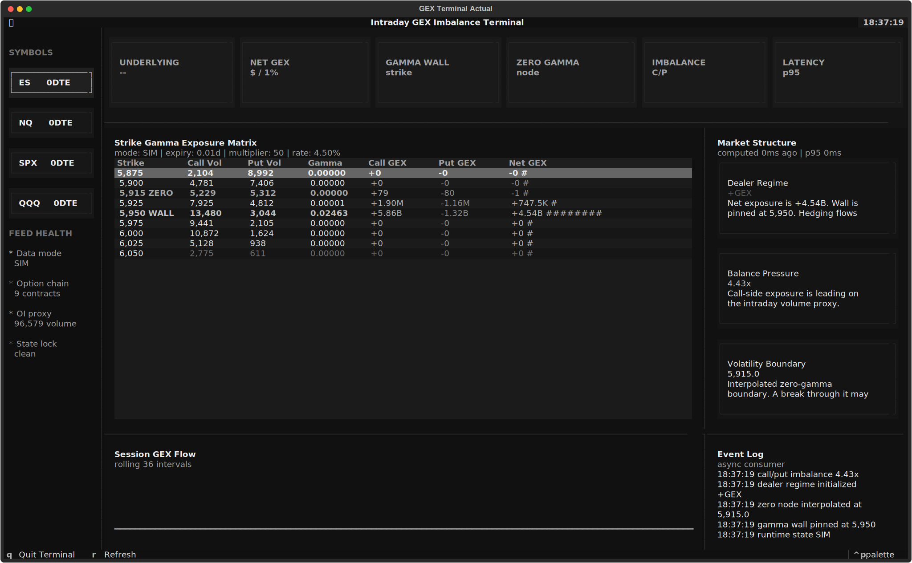
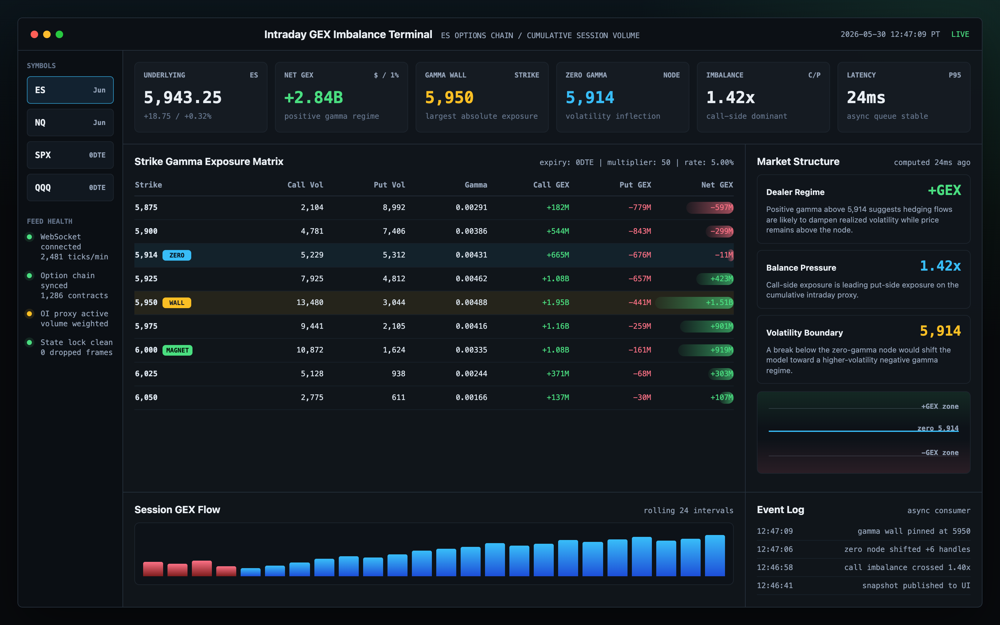

# gex-terminal

Intraday Gamma Exposure (GEX) imbalance tracking in a terminal UI.

An asynchronous, high-performance command-line dashboard for tracking real-time
dealer options hedging pressure in index futures such as **ES** and **NQ**. The
terminal uses cumulative intraday session volume as a proxy for changing open
interest, then translates live option-chain activity into strike-level gamma
exposure, imbalance, and structural market zones.

The goal is to isolate hidden institutional support, resistance, and volatility
acceleration boundaries at terminal speed, without the overhead of a browser UI.



Design target:



> This project is intended for market research and engineering experimentation.
> It is not financial advice.

## Project Layout

```text
.
|-- .env.example        # Template for local Tradovate credentials
|-- .gitignore          # Keeps secrets, virtualenvs, and caches out of Git
|-- .github/workflows/  # GitHub Actions smoke-test workflow
|-- LICENSE             # MIT License
|-- CONTRIBUTING.md     # Contribution guidelines and verification notes
|-- README.md           # Project overview and setup notes
|-- ROADMAP.md          # Planned project phases and future work
|-- SECURITY.md         # Credential handling and vulnerability reporting
|-- requirements.txt    # Runtime Python dependencies
|-- pyproject.toml      # Package metadata and console entry point
|-- main.py             # Backward-compatible CLI wrapper
|-- docs/               # Adapter and contributor-facing technical notes
|-- gex_terminal/       # Application package
|   |-- cli.py          # Console command and orchestration
|   |-- config.py       # Environment-driven runtime configuration
|   |-- engine.py       # Vectorized Black-Scholes and GEX calculation matrix
|   |-- consumer.py     # Stateful asynchronous market-data aggregator
|   |-- tui.py          # Textual reactive terminal user interface
|   |-- gex_terminal.tcss # Terminal dashboard theme and layout styles
|   |-- market_data_adapter.py # Shared provider adapter contract
|   `-- adapters/       # Replay and Tradovate market-data adapters
|-- sample_data/        # Normalized replay data for local demos
|-- tests/              # Math regression tests
```

## Core Features

- **Vectorized mathematical engine**: calculates Black-Scholes Greeks across the
  option chain with NumPy, avoiding slow per-contract Python loops.
- **Thread-safe state architecture**: uses asynchronous queues and guarded state
  updates to ingest high-frequency WebSocket ticks without race conditions.
- **Low-overhead terminal interface**: renders a live matrix in a Textual UI,
  keeping the workflow fast and local.
- **Intraday open-interest proxy**: treats cumulative session volume as the
  active positioning input when official open interest is stale or delayed.
- **Strike-level structural mapping**: identifies the gamma wall, zero-gamma
  node, net exposure bands, and call/put imbalance zones.
- **Credential isolation**: keeps API keys and production market-data credentials
  outside the execution logic through environment variables.

## Mathematical Foundation

The engine estimates dealer hedging pressure by calculating option gamma and
scaling it into **net intraday dollar gamma exposure per 1% underlying move**.

For each option contract, the Black-Scholes gamma is:

$$
\Gamma = \frac{N'(d_1)}{S \cdot \sigma \sqrt{t}}
$$

where:

$$
d_1 =
\frac{\ln(\frac{S}{K}) + (r + \frac{1}{2}\sigma^2)t}
{\sigma\sqrt{t}}
$$

and:

$$
N'(d_1) = \frac{1}{\sqrt{2\pi}}e^{-\frac{d_1^2}{2}}
$$

| Symbol | Meaning |
| --- | --- |
| $\Gamma$ | Option gamma |
| $N'(d_1)$ | Standard normal probability density function |
| $S$ | Current underlying spot or futures price |
| $K$ | Option strike price |
| $\sigma$ | Implied volatility |
| $t$ | Time to expiration, expressed as a fraction of a 365-day year |
| $r$ | Risk-free rate |

## Intraday Dollar GEX

Raw gamma is converted into dollar gamma exposure by scaling it with cumulative
transaction volume and contract multiplier.

Call exposure is treated as positive:

$$
\text{Call GEX} =
\text{Call Volume} \times \Gamma \times S \times
\left(\frac{S}{100}\right) \times \text{Multiplier}
$$

Put exposure is treated as negative:

$$
\text{Put GEX} =
\text{Put Volume} \times \Gamma \times S \times
\left(\frac{S}{100}\right) \times \text{Multiplier} \times (-1)
$$

Strike-level net gamma exposure is:

$$
\text{Net GEX}_K =
\text{Call GEX}_K + \text{Put GEX}_K
$$

Total session net gamma exposure is:

$$
\text{Total Net GEX} =
\sum_{K} \text{Net GEX}_K
$$

The call/put imbalance ratio can be represented as:

$$
\text{GEX Imbalance} =
\frac{\sum_K \text{Call GEX}_K}
{\left|\sum_K \text{Put GEX}_K\right|}
$$

Values above `1.0` indicate call-side gamma dominance; values below `1.0`
indicate put-side gamma dominance.

## Market Structure Metrics

The terminal derives key market zones from the strike-level GEX matrix:

- **Gamma Wall**: the strike with the largest absolute concentration of net
  dealer exposure. This level often behaves like a price magnet or overhead
  resistance/support zone.
- **Zero-Gamma Node**: the strike or interpolated price where net positioning
  flips sign from positive to negative. This marks the transition between a
  lower-volatility, mean-reverting regime and a higher-volatility, trend-prone
  regime.
- **Positive Gamma Zone**: a region where dealer hedging may dampen volatility as
  hedging flows lean against price movement.
- **Negative Gamma Zone**: a region where dealer hedging may amplify volatility
  as hedging flows move with price direction.
- **Imbalance Boundary**: the area where call-side and put-side dollar gamma
  exposure materially diverge, highlighting asymmetric hedging pressure.

## Runtime Architecture

```text
Market Data WebSocket
        |
        v
gex_terminal/consumer.py
  - Receives ticks
  - Normalizes option-chain payloads
  - Updates cumulative intraday volume
  - Publishes state snapshots
        |
        v
gex_terminal/engine.py
  - Vectorizes Black-Scholes inputs
  - Calculates gamma
  - Converts gamma to dollar GEX
  - Computes wall, node, and imbalance metrics
        |
        v
gex_terminal/tui.py
  - Renders live strike matrix
  - Displays aggregate exposure
  - Highlights structural zones
        |
        v
gex_terminal/cli.py
  - Starts async tasks
  - Coordinates shutdown
  - Handles application lifecycle
```

## Installation

Create a virtual environment:

```bash
python3 -m venv .venv
source .venv/bin/activate
```

Install dependencies:

```bash
pip install -e .
```

## Quick Start

Run the terminal with seeded demo data:

```bash
gex-terminal --demo
```

Run live mode for ES:

```bash
gex-terminal --mode live --symbol ES
```

Run NQ with its futures multiplier:

```bash
gex-terminal --demo --symbol NQ --multiplier 20
```

Export the actual Textual terminal screenshot used by GitHub:

```bash
gex-terminal --demo --screenshot assets/gex-terminal-actual.svg
```

## Configuration

Copy the example environment file and fill in your local Tradovate credentials:

```bash
cp .env.example .env
```

```bash
GEX_SYMBOL=ES
GEX_SYMBOLS=ES,NQ,SPX,QQQ
GEX_DATA_MODE=demo
GEX_CONTRACT_MULTIPLIER=50
GEX_RISK_FREE_RATE=0.045
GEX_DAYS_TO_EXPIRY=0.01
GEX_REFRESH_INTERVAL_SECONDS=1.0
GEX_STALE_AFTER_SECONDS=10.0
GEX_REPLAY_PATH=sample_data/demo_replay.jsonl
GEX_REPLAY_DELAY_SECONDS=0.05

TRADOVATE_ENV=demo
TRADOVATE_NAME=your_username
TRADOVATE_PASSWORD=your_password
TRADOVATE_APP_ID=your_app_id
TRADOVATE_APP_VERSION=1.0
TRADOVATE_CID=your_client_id
TRADOVATE_SEC=your_client_secret
```

Suggested futures multipliers:

| Product | Symbol | Multiplier |
| --- | --- | ---: |
| E-mini S&P 500 | ES | 50 |
| Micro E-mini S&P 500 | MES | 5 |
| E-mini Nasdaq-100 | NQ | 20 |
| Micro E-mini Nasdaq-100 | MNQ | 2 |

## Usage

Launch the terminal:

```bash
gex-terminal
```

Run with seeded demo data:

```bash
gex-terminal --demo
```

Run with normalized replay data:

```bash
gex-terminal --replay sample_data/demo_replay.jsonl
```

Override `.env` settings from the command line:

```bash
gex-terminal --mode live --symbol ES
gex-terminal --demo --symbol NQ --multiplier 20
gex-terminal --demo --refresh 0.5
```

Export an actual Textual screenshot for GitHub:

```bash
gex-terminal --demo --screenshot assets/gex-terminal-actual.svg
```

The dashboard is designed to update continuously as new option-chain and trade
events arrive. During a live session, the matrix should surface:

- strike-level call GEX
- strike-level put GEX
- net GEX by strike
- aggregate session GEX
- gamma wall
- zero-gamma node
- call/put imbalance
- positive and negative gamma zones

The terminal surfaces runtime lifecycle state as `LIVE`, `SIM`, `STALE`,
`CONNECTED`, or `DISCONNECTED` so the UI distinguishes real-time data from demo
and stale sessions.

If live mode is missing credentials or market-data dependencies, the app exits
with an install/configuration hint instead of a Python traceback:

```bash
pip install -e .
```

## Development Notes

- Keep `.env` out of version control.
- Keep market-data adapters isolated from calculation logic.
- Prefer vectorized NumPy operations inside `gex_terminal/engine.py`.
- Treat consumer state as shared mutable data and update it through explicit
  locks or queue ownership.
- Use deterministic fixtures for engine tests so the math can be regression
  tested independently from live data.
- See [CONTRIBUTING.md](CONTRIBUTING.md) for contribution guidelines.
- See [docs/adapters.md](docs/adapters.md) for the provider adapter contract.
- See [ROADMAP.md](ROADMAP.md) for planned phases and future work.
- See [SECURITY.md](SECURITY.md) for credential-handling guidance.

## Testing Targets

Recommended early test coverage:

- Black-Scholes gamma values against known reference cases.
- Dollar GEX conversion for calls and puts.
- Net GEX aggregation by strike.
- Zero-gamma interpolation across sign changes.
- Runtime lifecycle states for demo, live, stale, and disconnected sessions.
- Async consumer state updates under bursty tick delivery.
- Terminal rendering with empty, partial, and live-like snapshots.

## License

This project is licensed under the MIT License. See [LICENSE](LICENSE) for details.
