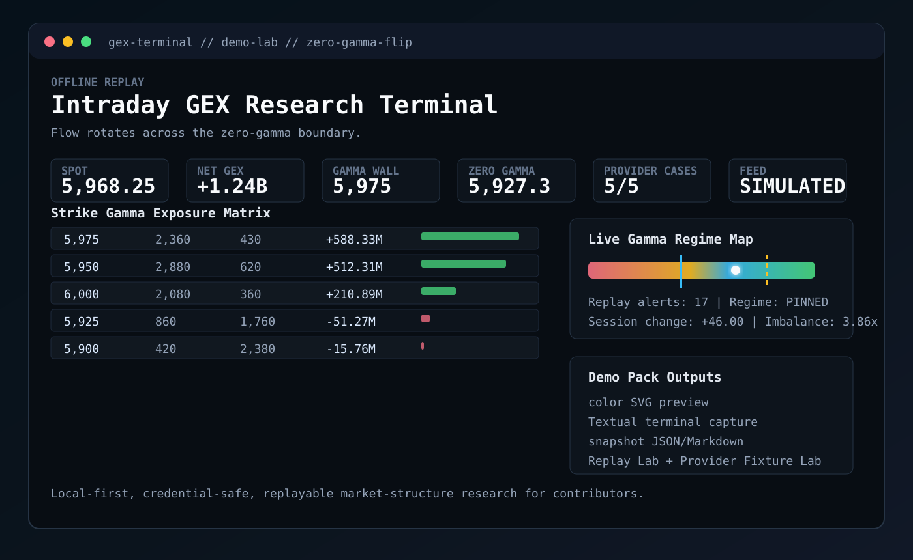
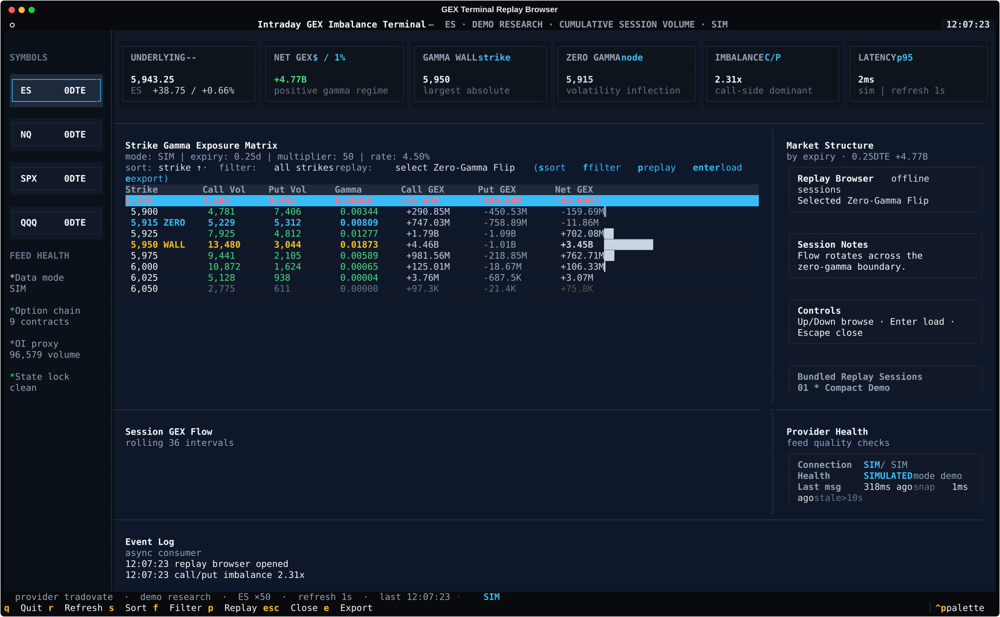
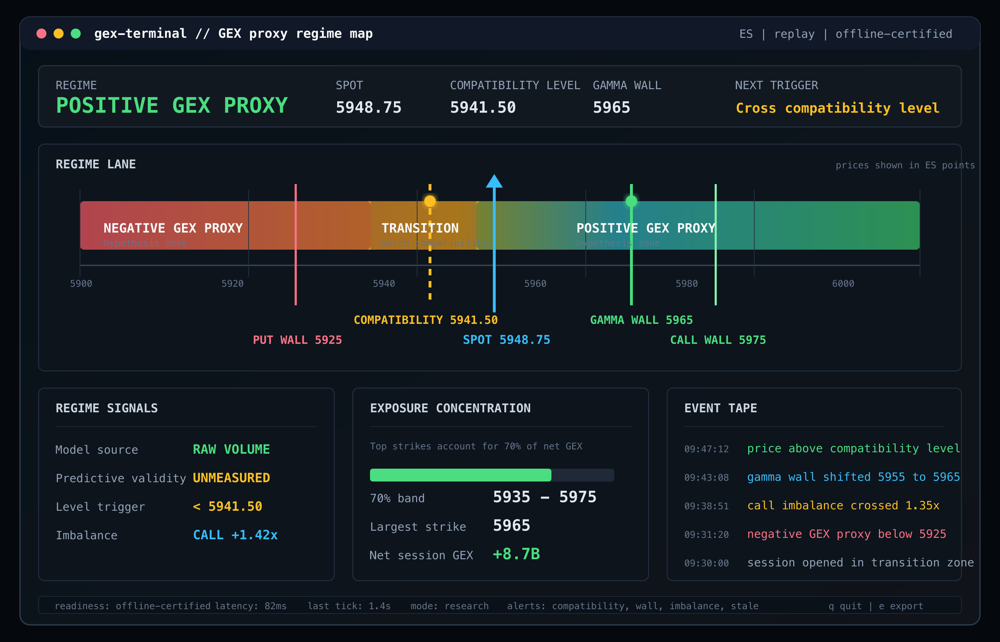

# gex-terminal

Intraday Gamma Exposure (GEX) imbalance tracking in a terminal UI.

An asynchronous, high-performance command-line dashboard for estimating
real-time gamma-exposure proxies in index futures such as **ES** and **NQ**. The
terminal uses explicitly labeled trade-volume or open-interest quantities as
positioning proxies, then translates option-chain activity into strike-level
gamma exposure, imbalance, and candidate market-structure zones.

The goal is to surface inspectable strike concentrations and volatility-regime
hypotheses at terminal speed, without the overhead of a browser UI. The inputs
do not observe dealer inventory, institutional intent, or predictive validity.



First-run replay browser:



Design target:



> This project is intended for market research and engineering experimentation.
> It is not financial advice.

## Why This Project Exists

`gex-terminal` is an open-source GEX research terminal for traders and developers
who want a local, explainable workflow instead of a closed market-structure
dashboard. The project is designed around:

- **Open-source model development**: contributors can inspect the assumptions,
  improve the math, and compare results against replayable sessions.
- **Local-first credential handling**: API keys and market-data credentials stay
  in local environment files, not in source code or hosted dashboards.
- **Transparent calculations**: the current model documents its practical
  assumptions, including trade-volume/open-interest source selection and the
  call-positive/put-negative sign convention.
- **Provider-agnostic ingestion**: market data flows through adapters so the app
  can grow beyond any single broker or feed.
- **Replayable research datasets**: normalized fixtures make it possible to
  learn, test, and reproduce behavior without paid data access.
- **Fast ES/NQ intraday workflow**: the terminal is built for traders who already
  have data access and want quick structural reads without browser overhead.

That openness is the invitation: contributors can improve the model, add
providers, submit normalized payload fixtures, and build export or visualization
tools without needing to join a closed commercial platform.

## Looking For Contributors

Helpful contributions include provider adapters, normalized market-data fixtures,
math/model improvements, terminal UI experiments, replay datasets, data-quality
checks, and docs that make GEX research easier to understand.

Good starting points:

- Pick an issue labeled `good first issue` or `help wanted`, or start from
  [docs/good-first-issues.md](docs/good-first-issues.md).
- Submit sanitized replay or provider payload fixtures.
- Improve the assumptions documentation around GEX calculations.
- Prototype one of the signature capabilities in the roadmap.
- Help validate provider-specific option-chain payload shapes.

## Project Layout

```text
.
|-- .env.example        # Template for local provider credentials
|-- .gitignore          # Keeps secrets, virtualenvs, and caches out of Git
|-- .github/workflows/  # GitHub Actions smoke-test workflow
|-- .github/ISSUE_TEMPLATE/ # Bug, feature, adapter, and good-first issue templates
|-- CHANGELOG.md        # Notable project changes and public-prep milestones
|-- CODE_OF_CONDUCT.md  # Community participation expectations
|-- LICENSE             # MIT License
|-- CONTRIBUTING.md     # Contribution guidelines and verification notes
|-- README.md           # Project overview and setup notes
|-- ROADMAP.md          # Planned project phases and future work
|-- SECURITY.md         # Credential handling and vulnerability reporting
|-- requirements.txt    # Runtime Python dependencies
|-- pyproject.toml      # Package metadata and console entry point
|-- main.py             # Backward-compatible CLI wrapper
|-- assets/             # Screenshots, mockups, and social preview assets
|-- docs/               # Adapter and contributor-facing technical notes
|-- gex_terminal/       # Application package
|   |-- cli.py          # Console command and orchestration
|   |-- config.py       # Environment-driven runtime configuration
|   |-- contracts.py    # Versioned contract identity, timing, and position semantics
|   |-- engine.py       # Vectorized Black-Scholes/Black-76 GEX calculation matrix
|   |-- consumer.py     # Stateful asynchronous market-data aggregator
|   |-- session_capture.py # Integrity-checked normalized event capture
|   |-- model_evidence.py # Bounded numerical model-evidence gate
|   |-- model_profiles.py # Versioned research assumptions
|   |-- experiment_manifest.py # Reproducible experiment identity and digests
|   |-- research_corpus.py # Append-only governed input registry
|   |-- batch_comparison.py # Multi-session position-model comparisons
|   |-- model_properties.py # Numerical/property certification gate
|   |-- provider_fault_lab.py # Deterministic provider-state fault cases
|   |-- performance_lab.py # Generated-chain performance budgets
|   |-- demo_lab.py     # Offline demo pack generator for screenshots and reports
|   |-- replay_lab.py   # Offline replay reports, alerts, and session comparisons
|   |-- research_journal.py # Local replay-session journal and comparisons
|   |-- session_store.py # Local historical snapshot records and reports
|   |-- screenshot.py   # Color-aware Textual SVG screenshot exports
|   |-- provider_fixture_lab.py # Offline provider fixture scorecards
|   |-- tui.py          # Textual reactive terminal user interface
|   |-- gex_terminal.tcss # Terminal dashboard theme and layout styles
|   |-- market_data_adapter.py # Shared provider adapter contract
|   |-- data/           # Replays and sanitized fixtures shipped in the wheel
|   `-- adapters/       # Replay, Tradovate, Databento, IBKR, and yfinance adapters
|-- tests/              # Regression and installed-release contract tests
```

## Core Features

- **Contract-aware mathematical engine**: prices futures options with Black-76
  and equity/index options with Black-Scholes, using per-contract DTE and
  multipliers before strike aggregation.
- **Versioned normalized contract**: schema v2 preserves provider-scoped
  contract identity, event time, expiry, instrument class, volume semantics,
  position source, and IV provenance while retaining the schema-v1 replay path.
- **Thread-safe state architecture**: uses asynchronous queues and guarded state
  updates to ingest high-frequency WebSocket ticks without race conditions.
- **Low-overhead terminal interface**: renders a live matrix in a Textual UI,
  keeping the workflow fast and local.
- **First-run offline workflow**: starts with useful demo state, explains how
  to proceed without credentials, and lets users browse bundled replay sessions
  from inside the terminal with `p`.
- **Terminal assumption controls**: cycle expiry filter, scalar DTE fallback,
  risk-free rate, and contract multiplier from the running terminal.
- **Explicit position semantics**: incremental trade updates accumulate;
  cumulative trade-volume or open-interest snapshots replace prior values for
  the same provider contract and are never silently added together.
- **Truthful strike-level mapping**: identifies the gamma wall, adjacent
  strike-profile sign flip, nearest-neutral strike, net exposure bands, and
  call/put imbalance zones.
- **Captured market sessions**: records normalized replay/live events to an
  append-only, internally hash-checked format and replays them on an event-time
  clock.
- **Bounded model evidence**: exports independent analytical oracles and
  deterministic checks while declaring predictive market validity unmeasured.
- **Governed offline research**: versioned model profiles, reproducible
  manifests, an append-only corpus registry, batch comparisons, and explicit
  property/fault/performance gates make multi-contributor evidence reviewable.
- **Parallel directionalized-volume research model**: preserves optional
  provider/quote-inferred aggressor side, reports known-direction coverage, and
  compares its signed profile with the unchanged default proxy without claiming
  participant identity or predictive validity.
- **Replay Research Lab**: runs bundled synthetic sessions offline, then exports
  session comparisons, replay alerts, and saved snapshot baselines.
- **Historical Research Journal**: saves local replay-session studies, lists
  prior entries, compares level changes, and exports Markdown/CSV/JSON reports.
- **Historical Session Store**: saves computed snapshot records locally, lists
  prior records, and exports Markdown/CSV/JSON summaries for later review.
- **Demo Lab pack**: generates a GitHub-ready offline preview folder with color
  SVG visuals, a theme-matched Textual terminal capture, snapshots, overlays,
  and lab reports.
- **Provider Fixture Workbench**: runs bundled provider-shaped fixtures offline,
  then exports health scorecards and adapter snapshots for contributor review.
- **Credential isolation**: keeps API keys and production market-data credentials
  outside the execution logic through environment variables.

## Mathematical Foundation

The engine calculates option gamma and scales the selected volume or
open-interest proxy into **net intraday dollar gamma exposure per 1% underlying
move**.
Schema-v2 futures options use Black-76; schema-v2 equity and index options use
Black-Scholes. Legacy schema-v1 fixtures retain their original Black-Scholes
path.

For Black-Scholes with continuous carry $q$, gamma is:

$$
\Gamma = \frac{e^{-qt}N'(d_1)}{S \cdot \sigma \sqrt{t}}
$$

where:

$$
d_1 =
\frac{\ln(\frac{S}{K}) + (r-q + \frac{1}{2}\sigma^2)t}
{\sigma\sqrt{t}}
$$

and:

$$
N'(d_1) = \frac{1}{\sqrt{2\pi}}e^{-\frac{d_1^2}{2}}
$$

| Symbol | Meaning |
| --- | --- |
| $\Gamma$ | Option gamma |
| $N'(d_1)$ | Standard normal probability density function |
| $S$ | Current underlying spot or futures price |
| $K$ | Option strike price |
| $\sigma$ | Implied volatility |
| $t$ | Time to expiration, expressed as a fraction of a 365-day year |
| $r$ | Risk-free rate |
| $q$ | Continuous carry/dividend yield; zero unless supplied |

For futures options, Black-76 gamma with futures price $F$ is:

$$
\Gamma_{76} =
\frac{e^{-rt}N'(d_1)}{F \cdot \sigma \sqrt{t}}
$$

The engine uses `ACT/365`. Each schema-v2 row is priced with its own expiry and
contract multiplier before rows at the same strike are aggregated.

## Intraday Dollar GEX

Raw gamma is converted into dollar gamma exposure by scaling it with the
selected contract quantity and multiplier. That quantity is identified as
`trade_volume`, `open_interest`, or the legacy volume proxy in snapshot
provenance.

Call exposure is treated as positive:

$$
\text{Call GEX} =
\text{Call Volume} \times \Gamma \times S \times
\left(\frac{S}{100}\right) \times \text{Multiplier}
$$

Put exposure is treated as negative:

$$
\text{Put GEX} =
\text{Put Volume} \times \Gamma \times S \times
\left(\frac{S}{100}\right) \times \text{Multiplier} \times (-1)
$$

Strike-level net gamma exposure is:

$$
\text{Net GEX}_K =
\text{Call GEX}_K + \text{Put GEX}_K
$$

Total session net gamma exposure is:

$$
\text{Total Net GEX} =
\sum_{K} \text{Net GEX}_K
$$

The call/put imbalance ratio can be represented as:

$$
\text{GEX Imbalance} =
\frac{\sum_K \text{Call GEX}_K}
{\left|\sum_K \text{Put GEX}_K\right|}
$$

Values above `1.0` indicate call-side gamma dominance; values below `1.0`
indicate put-side gamma dominance.

## Market Structure Metrics

The terminal derives key market zones from the strike-level GEX matrix:

- **Gamma Wall**: the strike with the largest absolute concentration of the
  modeled net-exposure proxy. It is a candidate level for replay or market
  study, not a demonstrated price magnet or support/resistance forecast.
- **Strike-Profile Flip**: a linear interpolation between adjacent strike
  buckets whose net-GEX values change sign. It is absent when no crossing
  exists.
- **Nearest-Neutral Strike**: the observed strike bucket with the smallest
  absolute net GEX.
- **Zero-Gamma Compatibility Field**: the historical `zero_gamma` field uses the
  strike-profile flip when available and otherwise the nearest-neutral strike.
  It is not a portfolio root found by repricing the entire book across spot.
- **Positive GEX Proxy Zone**: a region where the selected position proxy yields
  positive modeled exposure. Its market effect is a hypothesis for evaluation.
- **Negative GEX Proxy Zone**: a region where the selected position proxy yields
  negative modeled exposure. It does not identify dealer inventory or flow.
- **Imbalance Boundary**: the area where call-side and put-side modeled dollar
  GEX materially diverge in the selected quantities.

## Runtime Architecture

```text
gex_terminal/cli.py
  - loads environment configuration
  - selects demo, replay, live, or export workflow
  - starts adapter and calculation tasks

        |
        v

gex_terminal/adapters/*
  - translates provider or replay payloads
  - emits normalized underlying and option-volume messages

        |
        v

gex_terminal/consumer.py
  - owns async state mutation behind a lock
  - tracks provider-scoped contracts, position semantics, expiries, and quality
  - exposes reset_state for clean offline session switching

        |
        v

gex_terminal/engine.py
  - vectorizes Black-Scholes and Black-76 contract rows
  - converts volume proxy into dollar GEX
  - computes gamma wall, strike-profile flip, call/put walls, and concentration

        |
        v

gex_terminal/tui.py
  - renders the terminal matrix, structure panels, and feed health
  - guides first-run users toward offline replay and export workflows
  - browses bundled replay sessions in-app with the same consumer/engine path
  - lets users cycle expiry, DTE, rate, and multiplier controls

        |
        v

exports and reports
  - snapshot JSON/CSV/Markdown
  - TradingView overlay JSON/CSV
  - Replay Lab, Provider Fixture Lab, Demo Lab, Research Journal, Session Store,
    captured sessions, experiment/corpus/batch reports, offline certification,
    Tradovate certification, and model-evidence artifacts
```

See [docs/architecture.md](docs/architecture.md) for the fuller component map,
runtime paths, and contributor boundaries.

## Installation

Create a virtual environment:

```bash
python3 -m venv .venv
source .venv/bin/activate
```

Install dependencies:

```bash
pip install -e .
gex-terminal --version
```

Install the pinned official Databento SDK when using the live ES/NQ adapter or
its certification command:

```bash
pip install -e ".[databento]"
```

The broader `.[providers]` extra installs all optional provider clients. Offline
replays, fixtures, model comparisons, and numerical evidence do not require a
Databento key or SDK.

The source/package version is `0.3.0`, named **Offline Research Certification
Workbench**. Bundled replay sessions and sanitized
provider fixtures are package resources, so the installed wheel supports the
same named offline workflows from any working directory. This repository does
not claim a PyPI publication or release tag.

## Quick Start

Run the terminal with seeded demo data:

```bash
gex-terminal --demo
```

Inside the terminal, press `p` to open the bundled replay browser without
leaving the app. Demo mode starts by offering `zero-gamma-flip` because it shows
the most useful market-structure transition. Use Up/Down to choose a replay,
Enter to load it, and Escape to close the browser.

Run live mode for ES:

```bash
gex-terminal --mode live --provider tradovate --symbol ES
```

Run NQ with its futures multiplier:

```bash
gex-terminal --demo --symbol NQ --multiplier 20
```

Export a color-themed Textual terminal screenshot for GitHub:

```bash
gex-terminal --demo --screenshot assets/gex-terminal-actual.svg
gex-terminal --demo --screenshot assets/gex-terminal-onboarding.svg --screenshot-view replay-browser
```

## Configuration

Copy the example environment file and fill in your local Tradovate credentials:

```bash
cp .env.example .env
```

At startup, `gex-terminal` reads `.env` from the directory where you invoke the
command; existing process environment variables take precedence.

```bash
GEX_SYMBOL=ES
GEX_SYMBOLS=ES,NQ,SPX,QQQ
GEX_DATA_MODE=demo
GEX_DATA_PROVIDER=tradovate
GEX_CONTRACT_MULTIPLIER=50
GEX_RISK_FREE_RATE=0.045
GEX_DAYS_TO_EXPIRY=0.25
GEX_EXPIRY_FILTER=all
GEX_REFRESH_INTERVAL_SECONDS=1.0
GEX_STALE_AFTER_SECONDS=10.0
# Leave blank to use the demo replay bundled in the installed package.
GEX_REPLAY_PATH=
GEX_REPLAY_DELAY_SECONDS=0.05
GEX_REPLAY_CLOCK=auto
GEX_REPLAY_SPEED=1.0
GEX_REPLAY_MAX_GAP_SECONDS=
GEX_STRICT_EVENT_TIME=false

TRADOVATE_ENV=demo
TRADOVATE_NAME=your_username
TRADOVATE_PASSWORD=your_password
TRADOVATE_APP_ID=your_app_id
TRADOVATE_APP_VERSION=1.0
TRADOVATE_CID=your_client_id
TRADOVATE_SEC=your_client_secret

DATABENTO_API_KEY=your_databento_api_key
DATABENTO_DATASET=GLBX.MDP3

IBKR_HOST=127.0.0.1
IBKR_PORT=7497
IBKR_CLIENT_ID=17
```

Suggested futures multipliers:

| Product | Symbol | Multiplier |
| --- | --- | ---: |
| E-mini S&P 500 | ES | 50 |
| Micro E-mini S&P 500 | MES | 5 |
| E-mini Nasdaq-100 | NQ | 20 |
| Micro E-mini Nasdaq-100 | MNQ | 2 |

## Usage

Launch the terminal:

```bash
gex-terminal
```

Run with seeded demo data:

```bash
gex-terminal --demo
```

Run bundled normalized replay data by name:

```bash
gex-terminal list-replays
gex-terminal --replay-session demo
gex-terminal --replay-session full-session
gex-terminal --replay-session trend-day
gex-terminal --replay-session gap-fade
gex-terminal --replay-session call-wall-breakout
gex-terminal --replay-session zero-gamma-flip
```

`demo` is the shortest packaged fixture. `full-session` is a synthetic ES 0DTE
replay that walks through open, mid-session, and late-session activity without
requiring live credentials. Additional bundled sessions cover trend, chop,
volatility-spike, zero-gamma-flip, expiration
compression, gap-fade, call-wall-breakout, and provider-quality stress cases.

Use `--replay PATH` for a user-supplied normalized JSONL file. Named sessions are
preferred for bundled data because they work from both a source checkout and an
installed wheel.

Run the offline Replay Research Lab across bundled sessions:

```bash
gex-terminal replay-lab replay_lab.md
gex-terminal replay-lab replay_lab.json
gex-terminal replay-lab gap_fade_lab.csv --replay-session gap-fade
```

Create a local Historical Research Journal from replay sessions:

```bash
gex-terminal journal add --replay-session trend-day
gex-terminal journal add --replay-session zero-gamma-flip
gex-terminal journal list
gex-terminal journal compare
gex-terminal journal report research_journal/journal.md
```

Journal entries are written to `research_journal/entries/`, which is ignored by
Git. Use the journal to compare gamma wall, zero-gamma, call/put wall, net-GEX,
and alert changes while keeping live credentials and generated research output
local. See [docs/research-journal.md](docs/research-journal.md) for the
workflow.

Save computed snapshots in the Historical Session Store:

```bash
gex-terminal session-store save --replay-session zero-gamma-flip
gex-terminal session-store list
gex-terminal session-store report historical_sessions/session_store.md
```

Session records are written to `historical_sessions/sessions/`, which is ignored
by Git. Use the store for snapshot archives, later day-over-day review, and
issue-friendly Markdown/CSV summaries. See
[docs/historical-sessions.md](docs/historical-sessions.md) for details.

Generate a complete offline demo pack for screenshots, GitHub issues, or
contributor onboarding:

```bash
gex-terminal demo-lab demo_lab
gex-terminal demo-lab demo_lab --replay-session gap-fade
```

The demo pack writes a color preview SVG, theme-matched Textual screenshot,
snapshot exports, TradingView overlay exports, Replay Lab reports, Provider
Fixture Lab reports, and a local manifest. See [docs/demo-lab.md](docs/demo-lab.md)
for the artifact list.

Inject raw provider-shaped sample data without live credentials:

```bash
gex-terminal inject-provider bundled:tradovate-live-sample
gex-terminal inject-provider bundled:databento-glbx
gex-terminal inject-provider bundled:yfinance-etf-options
gex-terminal inject-provider bundled:cboe-option-quotes-csv
```

The stable `bundled:NAME` selector resolves package resources from a source
checkout or installed wheel. Use a filesystem path instead for your own local
fixture.

Provider injection replays raw or provider-shaped samples through adapter
parsing, consumer state, GEX math, snapshot export, and Provider Health
counters. It validates the software path offline; live auth, entitlements,
field drift, and reconnect behavior still require a credentialed provider
session.

Run every bundled provider-shaped fixture as an offline workbench report:

```bash
gex-terminal fixture-lab provider_fixture_lab.md
gex-terminal fixture-lab provider_fixture_lab.json
gex-terminal fixture-lab provider_fixture_lab.csv
```

The workbench currently covers sanitized Tradovate, Databento, yfinance, and
Cboe-style samples. It is useful before opening provider-adapter issues because
it captures pass/fail state, feed-health counters, computed walls, and the
snapshot baseline without using live credentials.

Record and replay an integrity-checked normalized session:

```bash
gex-terminal --replay-session trend-day --record-session --capture-path /tmp/trend-day.gex-session.jsonl
gex-terminal --captured-session /tmp/trend-day.gex-session.jsonl --replay-speed 20
gex-terminal session-store captures
```

See [docs/captured-sessions.md](docs/captured-sessions.md) for the header/event/footer
format, internally consistent hashes, atomic finalization, event-time clock,
replay-switch boundary, and journal workflow. In-file unkeyed hashes detect
corruption or unreconciled edits; they do not prove authenticity or historical
immutability without an external digest/signature.

Run the bounded numerical model-evidence gate:

```bash
gex-terminal model-evidence model_evidence.json
gex-terminal model-evidence model_evidence.md
```

The gate fails closed on numerical or deterministic regressions and explicitly
reports predictive market validity as `unmeasured`. See
[docs/model-validation.md](docs/model-validation.md).

Compare the unchanged default proxy with the optional aggressor-directionalized
model from a side-aware replay or the bundled Databento fixture path:

```bash
gex-terminal --replay /path/to/side-aware-session.jsonl \
  --model-comparison model_comparison.md
gex-terminal inject-provider bundled:databento-glbx \
  --model-comparison model_comparison.md
```

The report measures model disagreement and directional coverage; it does not
measure forecasting value. See
[docs/model-comparison.md](docs/model-comparison.md).

Run an explicit, read-only Tradovate network certification probe:

```bash
gex-terminal tradovate-certify tradovate_certification.json \
  --ack-live-network \
  --tradovate-environment demo \
  --symbol ES
```

The redacted report separates authentication, WebSocket authorization,
subscription acknowledgement, normalized messages, native/fallback IV, and its
evidence ceiling. The command exits nonzero when transport is not certified.
The adapter remains registry status `scaffold`; no live certification pass is
claimed by this repository.

Run the equivalent bounded Databento live-data gate for ES or NQ:

```bash
gex-terminal databento-certify databento_certification.json \
  --ack-live-network --symbol ES --multiplier 50 --certification-duration 20
```

It subscribes read-only to option/futures definitions, ES or NQ option trades,
and the volume-based continuous future's `mbp-1` stream. The report separates
transport, chain ingestion, and Black-76 IV-input certification. No successful
credentialed run is claimed by the repository; the command must be run with the
user's own key and entitlements. For NQ, use `--symbol NQ --multiplier 20` and a
separate output file. Exit status `0` requires the full quantitative-input gate;
transport-only or partial-chain observations write their evidence and exit `2`.

Exercise the same Databento record handler entirely offline, including temporal
alignment and adversarial failure cases:

```bash
gex-terminal databento-replay \
  gex_terminal/data/provider_fixtures/databento_mixed_offline_records.jsonl \
  offline_replay.json --symbol ES --multiplier 50
gex-terminal databento-offline-certify offline_certification.json \
  --symbol ES --multiplier 50
```

Evaluate saved price action and compare point-in-time OI, raw-volume, and
directionalized models without live data:

```bash
gex-terminal price-action-evaluate INPUT.json OUTPUT.json
gex-terminal position-model-compare INPUT.json OUTPUT.json \
  --symbol ES --multiplier 50
```

These commands preserve `live_transport_certified=false` and
`predictive_validity=unmeasured`. See
[docs/offline-validation.md](docs/offline-validation.md) for their input contracts.

Run and reproduce a versioned experiment, verify a governed local corpus,
compare multiple sessions, and exercise the broader offline gates:

```bash
gex-terminal experiment-run experiment_spec.json /tmp/gex-experiment
gex-terminal experiment-reproduce /tmp/gex-experiment/manifest.json /tmp/gex-reproduction
gex-terminal corpus-init /tmp/gex-corpus --corpus-id es-research-v1
gex-terminal corpus-register /tmp/gex-corpus INPUT.json METADATA.json
gex-terminal corpus-verify /tmp/gex-corpus /tmp/gex-corpus-report.json
gex-terminal batch-position-compare batch_spec.json batch_report.json
gex-terminal model-property-certify /tmp/model-properties.json
gex-terminal provider-fault-certify /tmp/provider-faults.json
gex-terminal performance-certify /tmp/performance.json
```

These are reproducibility and software gates, not live-feed or predictive
certification. See [docs/research-governance.md](docs/research-governance.md).

Override `.env` settings from the command line:

```bash
gex-terminal --providers
gex-terminal --mode live --provider tradovate --symbol ES
gex-terminal --mode live --provider databento --symbol ES --multiplier 50
gex-terminal --mode live --provider databento --symbol NQ --multiplier 20
gex-terminal --mode live --provider ibkr --symbol ES
gex-terminal --mode live --provider yfinance --symbol SPY
gex-terminal --demo --symbol NQ --multiplier 20
gex-terminal --demo --refresh 0.5
gex-terminal --replay-session full-session --expiry-filter 0dte
```

Export a color-themed Textual screenshot for GitHub:

```bash
gex-terminal --demo --screenshot assets/gex-terminal-actual.svg
gex-terminal --replay-session zero-gamma-flip --screenshot assets/gex-terminal-actual.svg
```

Export a JSON snapshot of the current GEX state (metrics, call/put walls,
concentration, expiry breakdown, and the full strike matrix). The extension
controls the format:

```bash
gex-terminal --demo --export gex_snapshot.json
gex-terminal --demo --export gex_snapshot.csv
gex-terminal --demo --export gex_snapshot.md
```

Export TradingView-friendly overlay levels and bands:

```bash
gex-terminal --demo --tradingview-overlay gex_levels.json
gex-terminal --demo --tradingview-overlay gex_levels.csv
```

Validate a normalized replay or provider fixture before submitting it:

```bash
gex-terminal validate-fixture gex_terminal/data/replays/es_trend_day.jsonl
```

The direct validation path above is a source-checkout contributor workflow;
ordinary users should select packaged replays with `--replay-session`.

Compare model sensitivity to multiplier, expiry, rate, IV, and volume/OI proxy
assumptions:

```bash
gex-terminal --demo --sensitivity sensitivity.md
gex-terminal --replay-session trend-day --sensitivity sensitivity.csv
```

Simulate provider-health states without live data:

```bash
gex-terminal --demo --quality-scenario all
```

While the terminal is running, these keys are available:

| Key | Action |
| --- | --- |
| `r` | Refresh the snapshot now |
| `s` | Cycle strike sort (strike / \|net\| / volume) |
| `f` | Cycle strike filter (all / near-money / active) |
| `p` | Open or close the bundled replay browser in demo/replay mode |
| `up` / `down` | Move through replay sessions while the browser is open |
| `enter` | Load the selected replay session |
| `escape` | Close the replay browser |
| `x` | Cycle expiry filter (all / 0DTE / exact expiry) |
| `d` | Cycle DTE assumptions |
| `m` | Cycle contract multiplier assumptions |
| `i` | Cycle risk-free rate assumptions |
| `e` | Export the current snapshot to a timestamped JSON file |
| `q` | Quit |

The dashboard is designed to update continuously as new option-chain and trade
events arrive. During a live session, the matrix should surface:

- strike-level call GEX
- strike-level put GEX
- net GEX by strike
- aggregate session GEX
- gamma wall
- strike-profile flip and nearest-neutral strike (`zero_gamma` compatibility field)
- call/put imbalance
- positive and negative gamma zones
- GEX Proxy Regime Map state with spot, the zero-gamma compatibility level,
  gamma wall, and next trigger
- Provider Health panel with connection state, stale checks, latency, dropped
  payloads, malformed payloads, provider frame counts, parse errors,
  subscription status, reconnect counts, and entitlement placeholders

The terminal surfaces runtime lifecycle state as `LIVE`, `SIM`, `REPLAY`,
`STALE`, `CONNECTED`, or `DISCONNECTED` so the UI distinguishes real-time data
from demo, replay, and stale sessions.

Tradovate protocol parsing is covered by sanitized package fixtures and mocked
transport tests. The adapter uses the official raw-token WebSocket authorization
frame, waits for authorization and subscription acknowledgements, maps nested
quote entries, treats `TotalTradeVolume` and `OpenInterest` as cumulative, and
cleans up subscriptions on shutdown. Official quote frames do not establish
native implied volatility, so fallback-IV use is surfaced as degraded model
input. Only an explicit credentialed `tradovate-certify` run can certify one
environment and time window; fixture success is not a live-data claim.

Databento live mode uses the optional official Python SDK and mixed-schema
`GLBX.MDP3` subscriptions for ES/NQ definitions, option trades, and continuous
futures top-of-book quotes. When Databento does not supply IV directly, the
adapter inverts each eligible option trade with Black-76 against the latest
observed futures midpoint. The normalized tick records the solver inputs,
convergence, and price error; missing or invalid inputs remain a labeled
configured fallback. Only `databento-certify --ack-live-network` can measure a
specific credential, entitlement set, symbol, and run window.

If live mode is missing credentials or market-data dependencies, the app exits
with an install/configuration hint instead of a Python traceback:

```bash
pip install -e .
# Databento live mode additionally requires:
pip install -e ".[databento]"
```

## Development Notes

- Keep `.env` out of version control.
- Keep market-data adapters isolated from calculation logic.
- Prefer vectorized NumPy operations inside `gex_terminal/engine.py`.
- Treat consumer state as shared mutable data and update it through explicit
  locks or queue ownership.
- Use deterministic fixtures for engine tests so the math can be regression
  tested independently from live data.
- See [CONTRIBUTING.md](CONTRIBUTING.md) for contribution guidelines.
- See [CODE_OF_CONDUCT.md](CODE_OF_CONDUCT.md) for community expectations.
- See [CHANGELOG.md](CHANGELOG.md) for notable project changes.
- See [docs/adapters.md](docs/adapters.md) for the provider adapter contract.
- See [docs/architecture.md](docs/architecture.md) for runtime architecture,
  first-run flow, state ownership, and contributor boundaries.
- See [docs/databento-fixtures.md](docs/databento-fixtures.md) for Databento
  fixture mapping, live certification, multiplier requirements, and GLBX.MDP3
  schema notes.
- See [docs/demo-lab.md](docs/demo-lab.md) for the no-credential demo pack,
  color preview, screenshots, snapshots, overlays, and lab report bundle.
- See [docs/exports.md](docs/exports.md) for snapshot and TradingView overlay
  export formats.
- See [docs/model-assumptions.md](docs/model-assumptions.md) for GEX model
  assumptions and limitations.
- See [docs/model-validation.md](docs/model-validation.md) for numerical oracles,
  deterministic checks, snapshot provenance, and the predictive evidence ceiling.
- See [docs/model-comparison.md](docs/model-comparison.md) for the parallel
  directionalized-volume model, evidence limits, and comparison harness.
- See [docs/offline-validation.md](docs/offline-validation.md) for temporal
  integrity, raw Databento replay, adversarial certification, saved-price-action
  evaluation, and point-in-time position-source comparisons.
- See [docs/research-governance.md](docs/research-governance.md) for model
  profiles, experiment manifests, corpus registration, batch comparisons, and
  the property/fault/performance evidence gates.
- See [docs/SAED_ADOPTION_PROFILE.md](docs/SAED_ADOPTION_PROFILE.md) for the
  repository's change-routing, evidence, and release methodology.
- See [docs/captured-sessions.md](docs/captured-sessions.md) for normalized event
  capture, integrity verification, event-time replay, and local inventory.
- See [docs/provider-injection.md](docs/provider-injection.md) for raw
  provider-shaped fixture injection without live credentials.
- See [docs/product-vision.md](docs/product-vision.md) for signature capability
  concepts and mockups.
- See [docs/replay-lab.md](docs/replay-lab.md) for offline replay reports,
  alerts, saved snapshot comparisons, and screenshot workflow.
- See [docs/replay-research.md](docs/replay-research.md) for bundled replay
  sessions, fixture validation, quality simulations, and sensitivity reports.
- See [docs/research-journal.md](docs/research-journal.md) for local historical
  replay journals, entry comparisons, and report exports.
- See [ROADMAP.md](ROADMAP.md) for planned phases and future work.
- See [SECURITY.md](SECURITY.md) for credential-handling guidance.

## Testing Targets

Recommended early test coverage:

- Black-Scholes and Black-76 gamma values against independent reference cases
  and finite-difference checks.
- Contract-specific DTE/multiplier pricing, mixed model rows, invalid inputs,
  position semantics, expiry filtering, and same-strike aggregation.
- Dollar GEX conversion for calls and puts.
- Net GEX aggregation by strike.
- Zero-gamma interpolation across sign changes.
- Runtime lifecycle states for demo, live, stale, and disconnected sessions.
- Provider health summaries for simulated, stale, degraded, disconnected, and
  entitlement-error states.
- First-run terminal guidance, in-app replay selection, and consumer reset
  behavior for offline session switching.
- TradingView overlay export rows for levels and exposure bands.
- GEX Proxy Regime Map classification for positive, negative, compatibility,
  and wall-proximity states.
- Replay Lab reports for alerts, session comparison, and saved snapshot
  baselines.
- Historical Research Journal entries, entry comparisons, and Markdown/CSV/JSON
  report exports.
- Demo Lab packs for color previews, color-themed terminal screenshots,
  snapshots, overlays, and offline lab reports.
- Fixture validation for replay/provider JSONL submissions.
- Databento fixture mapping for definitions, trades, underlying quotes, and
  statistics-style open interest.
- Provider Fixture Workbench reports for bundled provider-shaped samples.
- Model sensitivity reports across multiplier, expiry, rate, IV, and volume/OI
  assumptions, including base-scenario parity with contract-aware snapshots.
- Captured-session round trips, hashes, sequence integrity, `.partial` rejection,
  and strict/non-strict event-time replay.
- Model-evidence exports and the explicit `unmeasured` predictive-validity ceiling.
- Wheel contents, package-resource access from another working directory,
  CWD `.env` loading, portable serialized resource identities, console
  `--version`, and installed offline workflows.
- Delayed yfinance ETF option-chain normalization with mocked adapter tests.
- Async consumer state updates under bursty tick delivery.
- Terminal rendering with empty, partial, and live-like snapshots.

## License

This project is licensed under the MIT License. See [LICENSE](LICENSE) for details.
