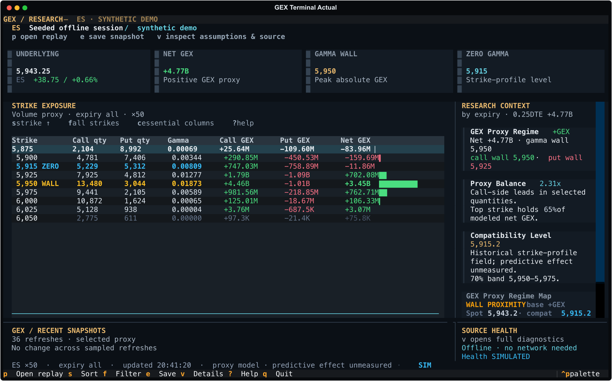
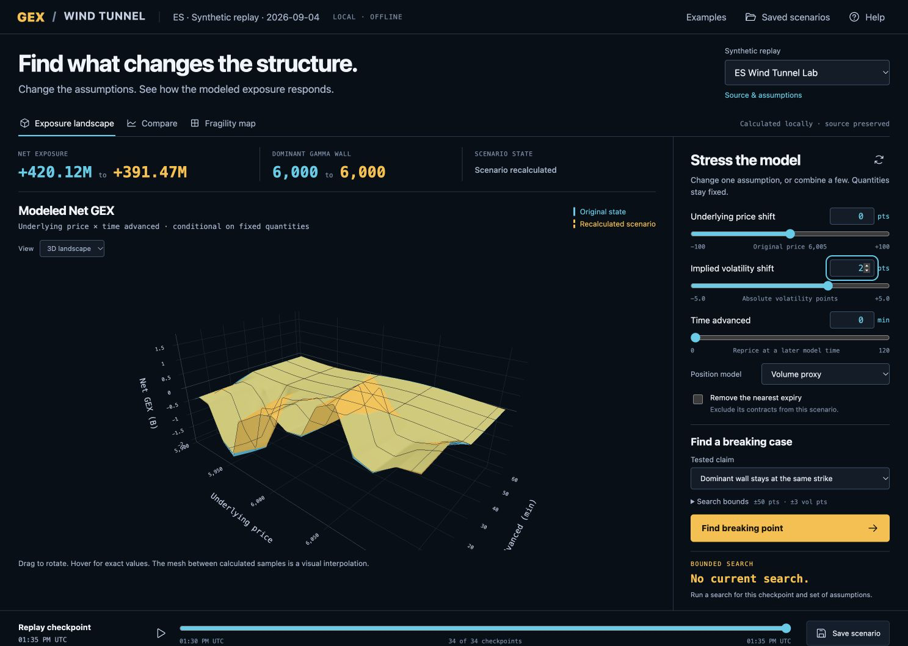
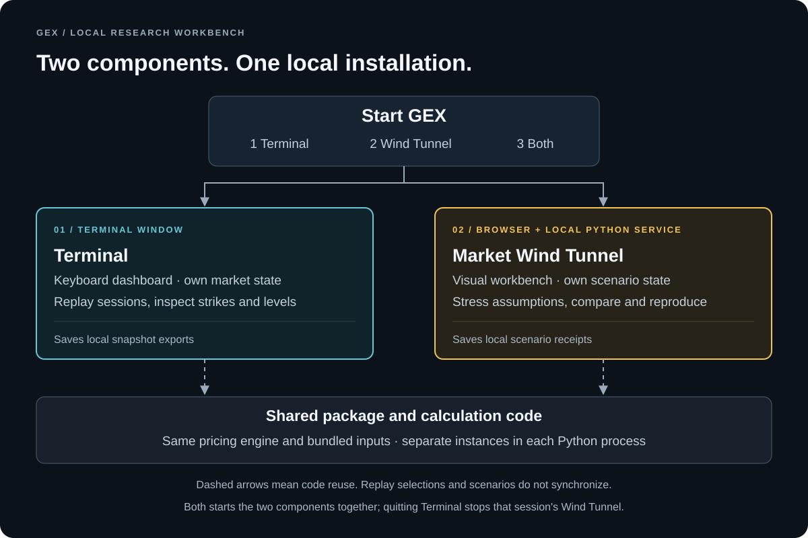

# gex-terminal

**One local installation. Two research interfaces: Terminal and Market Wind Tunnel.**

`gex-terminal` is an open-source workbench for inspecting gamma exposure (GEX)
proxies in ES, NQ, and related options markets. Use the **Terminal** to inspect a
session and its strike-level structure. Use the **Market Wind Tunnel** to change
assumptions and explore how that structure responds. Start either component on
its own, or choose **Both** in the starter.

Both components work offline with bundled synthetic data.

[Install](#install) · [Quick start](#quick-start) ·
[Architecture](docs/architecture.md#c4-views) · [Roadmap](ROADMAP.md)

## Two Components, One Installation

| Component | What you do | What you see |
| --- | --- | --- |
| [Terminal](#terminal) | Load a replay, inspect exposure and source quality, adjust model controls, export a snapshot | A keyboard-driven dashboard with metrics, strike rows, walls and replay controls |
| [Market Wind Tunnel](#market-wind-tunnel) | Change price, volatility, time or expiry assumptions; compare scenarios and save reproducible results | A browser workbench with exposure landscapes, comparisons, fragility maps and bounded break searches |

### Terminal

Inspect the structure of a session: exposure by strike, modeled levels, source
quality and the assumptions behind the numbers. Press `p` to select a replay,
`v` to inspect source and model details, and `e` to export a snapshot.



*Actual Terminal capture with seeded synthetic data. The dashboard is operated
with the keyboard. [Terminal guide](docs/first-run.md).*

### Market Wind Tunnel

Ask “what changes if…?” without changing the source checkpoint. Shift spot,
implied volatility or model time, exclude the nearest expiry, and compare the
recalculated structure. Save a scenario receipt to verify or reproduce later.



*Actual Wind Tunnel capture: synthetic ES, final replay checkpoint, IV shifted
by +2 volatility points. Cyan marks the original state and gold the recalculated
scenario. [Wind Tunnel guide](docs/wind-tunnel.md).*

## How The Components Fit Together



The **Terminal** runs in a terminal window. The **Wind Tunnel** runs in your
browser, served by a separate Python process on your own computer. Its charts
and scripts are included in the installation; no hosted service is needed.

Choosing **Both** starts the two components together. Quitting Terminal stops
that session's Wind Tunnel server; closing only the browser tab does not.
A separately launched instance keeps running. Replay choices, checkpoints and
scenario changes are **not automatically synchronized** between the views.

The shared engine is reusable code loaded by each process, not a central service
or shared live session. The [architecture diagrams](docs/architecture.md#c4-views)
show the process, state and local storage boundaries.

## Install

Use Python 3.11/3.12 and a reviewed setup folder supplied by your maintainer.
On macOS, open **Install.command**; on Linux, run `sh Install.command`.
Setup checks the build. In a fresh Wind Tunnel-capable setup, open
**GEX App/Start GEX.command** on macOS or run **`"./GEX App/run-gex" --choose`**
on Linux to choose **Terminal**, **Wind Tunnel** or **Both**. The interactive
installer offers the same choice. No environment activation or provider
credentials are needed. Research stays in a separate **GEX App Research** folder.

The first setup downloads dependencies unless the supplied folder includes
dependency wheels for your platform and Python version. The app then runs
offline. Keep its installation folder in place. Follow
[First Run](docs/first-run.md) for setup details, the manual wheel alternative,
the guided journey, update and uninstall.
Developers start with [Contributing](CONTRIBUTING.md).
Maintainers preparing observed first use follow [Study Build](docs/study-build.md).

## Quick Start

Choose **Wind Tunnel** in the starter for browser research, or **Both** to
open it alongside the terminal. Both manages their lifetime together: quitting
the terminal also stops that Wind Tunnel server. The two views keep independent
research state. The direct **Start Wind Tunnel.command** / **run-wind-tunnel**
shortcuts remain available. For a manual wheel installation:

```bash
gex-terminal wind-tunnel
```

The local browser workbench includes three worked examples. Change spot, IV,
time or expiry assumptions, compare the resulting structure and save a receipt.
Charts and calculations use bundled synthetic data and work without a provider
account or internet connection. See [Market Wind Tunnel](docs/wind-tunnel.md).

Choose **Terminal**, open **Start Terminal.command**, or run **`"./GEX App/run-gex"`**
to open a bundled synthetic replay directly. For a manual wheel installation,
start with seeded offline data:

```bash
gex-terminal --demo
```

Press `p` to open the replay browser, use Up/Down to choose a session, and press
Enter to load it. Press `e` to save a snapshot, `v` for source and model details,
`?` for help, and `q` to quit. The terminal works from 100×32 cells; 140×42 gives
the full table more room. Press `c` to switch between essential and full columns.
See First Run for model controls and interpretation.

Run a named replay or list the packaged catalog:

```bash
gex-terminal list-replays
gex-terminal --replay-session zero-gamma-flip
```

Credentials belong in the local environment and must never be committed. See
[Security](SECURITY.md) before using a live provider.

## What It Does

The two interfaces are backed by the same research tools:

- Price futures-option rows with Black-76 and equity/index-option rows with
  Black-Scholes before strike aggregation.
- Keep open interest, raw trade volume, and directionalized volume as separate
  position models.
- Replay bundled sessions and provider-shaped fixtures without credentials.
- Build portable packs with authorized input, separated model comparisons and
  verifiable receipts; support local diagnosis, backup and recovery.
- Keep provider readiness, runtime connection state, model verification and
  predictive validity as separate claims.

The intended users are quant/model researchers, Python/data engineers, and
advanced traders who want an inspectable local workflow. See
[Model Assumptions](docs/model-assumptions.md) for definitions and limitations.

> For market research and engineering experimentation. Proxy calculations are
> not observed dealer inventory, market forecasts or financial advice.

## Current Status

Version **0.6.0 — Market Wind Tunnel** is a research alpha. The
repository and reviewed Git tag are the release record; no PyPI publication or
hosted GitHub Release is claimed.

Bundled demo/replay is `offline-certified`. Databento is `live-uncertified`;
Tradovate and IBKR remain scaffolds; yfinance is delayed. Details belong in
[Market-Data Adapters](docs/adapters.md) and the dated
[Application Review](docs/application-review.md).

`predictive_validity` remains `unmeasured`. Offline tests and fixtures verify
software behavior. A credentialed certification report can establish bounded
transport and input evidence for its exact run, but neither form of evidence
establishes a forecasting edge, durable provider-wide reliability, execution
quality, or profitability.

## Common Workflows

The README is the front door, not the command reference. Each workflow has one
canonical guide:

| Goal | Starting command | Guide |
| --- | --- | --- |
| Stress market structure offline | `gex-terminal wind-tunnel` | [Market Wind Tunnel](docs/wind-tunnel.md) |
| Diagnose a local installation | `gex-terminal doctor` | [Offline Doctor](docs/doctor.md) |
| Explore bundled market days | `gex-terminal --replay-session trend-day` | [Replay Research](docs/replay-research.md) |
| Generate a shareable offline pack | `gex-terminal demo-lab demo_lab` | [Demo Lab](docs/demo-lab.md) |
| Exercise provider-shaped fixtures | `gex-terminal fixture-lab report.md` | [Provider Injection](docs/provider-injection.md) |
| Record and replay normalized events | `gex-terminal --replay-session trend-day --record-session` | [Captured Sessions](docs/captured-sessions.md) |
| Validate model math | `gex-terminal model-evidence report.json` | [Model Validation](docs/model-validation.md) |
| Compare position models | `gex-terminal position-model-compare INPUT.json OUTPUT.json` | [Offline Validation](docs/offline-validation.md) |
| Run reproducible governed research | `gex-terminal experiment-run SPEC.json OUTPUT_DIR` | [Research Governance](docs/research-governance.md) |
| Export snapshots and overlays | `gex-terminal --demo --export snapshot.json` | [Export Formats](docs/exports.md) |

Private backup/recovery and safe support output belong in
[Local Support](docs/local-support.md).

Use `gex-terminal --help` for the complete command surface.

## Documentation

[Documentation Map](docs/README.md) lists the canonical owner for each topic and
routes readers to the detailed guides.

- [Architecture](docs/architecture.md) — current structure and state ownership.
- [Roadmap](ROADMAP.md) — planned and deferred work, including the next gate.
- [Changelog](CHANGELOG.md) — shipped history.
- [Product Vision](docs/product-vision.md) — durable product direction.
- [Competitive Analysis](docs/market-analysis.md) — dated market evidence and
  positioning.
- [Contributing](CONTRIBUTING.md) — setup, verification, and pull-request rules.
- [Security](SECURITY.md) — credential handling and vulnerability reporting.

## Contributing

Start with [Contributing](CONTRIBUTING.md) and the scoped
[Good First Issues](docs/good-first-issues.md). Material model, provider, live
data, or research-authority changes must follow the repository's
[SAED adoption profile](docs/SAED_ADOPTION_PROFILE.md).

## License

Licensed under the MIT License. See [LICENSE](LICENSE).
