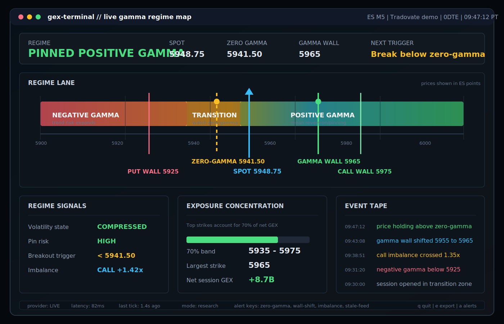

# Roadmap

This roadmap captures the major directions for `gex-terminal`. The project is
still early, so priorities may shift as the data model, provider integrations,
and terminal workflow become clearer.

## High-Impact Concepts

These are the larger "wow" features that would make `gex-terminal` feel less
like a generic dashboard and more like a focused market-structure workstation.

### Live Gamma Regime Map

Build a real-time regime panel showing whether price is in positive gamma,
negative gamma, near zero-gamma, pinned near a gamma wall, or entering a
volatility expansion zone.

### Replayable Market Days

Save full intraday sessions and replay them later with synchronized GEX, price,
wall shifts, zero-gamma moves, and event markers.

### TradingView Overlay Export

Export gamma wall, zero-gamma, call wall, put wall, and major exposure bands into
a TradingView-compatible format so users can overlay levels on their charts.

### GEX Alert Engine

Trigger local alerts for zero-gamma crosses, gamma wall shifts, stale data,
regime flips, and major call/put imbalance changes, with optional Discord or
webhook output.

### Multi-Symbol Market Structure Scanner

Scan ES, NQ, SPX, SPY, QQQ, and IWM to rank symbols by gamma concentration,
negative-gamma risk, 0DTE pressure, and the biggest intraday structural shifts.

## Phase 1: Prototype Hardening

- [x] Add a local mock-data and replay mode that can run without live Tradovate
  credentials.
- [x] Add deterministic tests for the math engine, consumer state updates, and
  malformed market-data messages.
- [x] Move runtime settings into a typed configuration layer for symbol, multiplier,
  risk-free rate, expiry target, provider, and update interval.
- [x] Improve startup validation so missing credentials or unsupported provider
  settings fail with clear messages.
- [ ] Document the current model assumptions, including the
  volume-as-open-interest proxy, call/put sign convention, and limitations versus
  proprietary dealer-positioning models.

## Phase 2: Live Data Reliability

- [ ] Complete real options-chain discovery for active ES/NQ contracts.
  Initial Tradovate discovery scaffolding exists; the next step is validating
  the exact option-chain payload shape against live/demo API access.
- [ ] Make one live provider production-ready end to end before expanding the
  provider list beyond scaffolds.
- [ ] Harden Tradovate reconnect, backoff, heartbeat, and shutdown behavior.
- [ ] Add official open-interest ingestion when provider entitlements support it
  so the terminal can move beyond the intraday volume proxy.
- [x] Normalize provider payloads through a stable adapter contract before they
  reach the state consumer.
- [x] Track provider connection status, last message time, and data freshness in
  the terminal UI (runtime status LIVE/SIM/STALE/DISCONNECTED, feed-health rail,
  status bar with last-refresh time, and stale/disconnected matrix banners).
- [ ] Add a data-quality panel for provider latency, dropped messages, stale
  fields, and entitlement failures.
- [ ] Add logging controls suitable for live, demo, and debug sessions.

## Phase 3: Market Structure Metrics

- [x] Add call wall, put wall, and gamma concentration bands. The engine now
  reports call/put walls, a top-strike concentration ratio, and the 70% net-gamma
  band; all surface in the Market Structure panel alongside the gamma wall and
  regime read.
- [x] Improve zero-gamma detection with interpolation across strike-level sign
  changes.
- [x] Track intraday changes in total net GEX, gamma wall, and zero-gamma levels
  (event log records wall shifts, zero-node moves, regime flips, and imbalance
  threshold crossings; Session GEX Flow sparkline trends net GEX).
- [x] Support exposure breakdowns by expiry. Ticks may carry an `expiry` tag and
  the consumer reports net GEX per expiry (single session bucket otherwise);
  populating multiple live expiries still depends on Phase 2 chain discovery.
- [ ] Add first-class 0DTE filtering and expiration selection in the runtime
  configuration and terminal UI.
- [ ] Add dealer/customer direction inference so GEX sign handling can move
  beyond a naive call-positive/put-negative convention when data supports it.
- [ ] Add Delta Exposure (DEX), vanna, charm, vega, and theta exposure metrics
  after the live option-chain model stabilizes.
- [x] Add exportable snapshot summaries for later review (JSON via `--export PATH`
  or the in-app `e` key; includes metrics, walls, concentration, expiry breakdown,
  and the full strike matrix).

## Phase 4: Terminal Experience

- [x] Add color-coded positive and negative GEX rows.
- [x] Improve empty, loading, disconnected, and error states.
- [x] Add sorting or filtering for strikes, expirations, and high-concentration
  levels.
- [x] Add a compact status bar for provider, symbol, update cadence, and last refresh
  time.
- [x] Include a README screenshot or GIF once mock replay mode can render a stable
  demo.
- [ ] Add a Live Gamma Regime Map panel that summarizes positive/negative gamma,
  zero-gamma proximity, wall-pinning risk, and volatility expansion zones.
  Mockup: [assets/live-gamma-regime-map-mockup.svg](assets/live-gamma-regime-map-mockup.svg).
- [ ] Add alerts for gamma wall shifts, zero-gamma crosses, stale data, and major
  exposure changes.
- [ ] Add export formats designed for TradingView overlays, Discord posts, and
  lightweight webhooks.

## Phase 5: Contributor-Friendly Architecture

- [x] Define a provider adapter interface and document how to add new data sources.
- [x] Keep Tradovate as the first adapter, then add replay/CSV as a no-credential
  reference adapter.
- [x] Add provider registry scaffolds for Databento, IBKR, and yfinance.
- [x] Add issue templates for bugs, feature requests, and provider adapters.
- [x] Add a security policy for credential-handling issues.
- [ ] Publish sample replay datasets so new users can evaluate the app without
  paid data.
- [ ] Add contribution notes for normalized provider payload fixtures.
- [ ] Add a small set of labeled good-first issues after the first public push.

## Phase 6: Packaging and Distribution

- [x] Add `pyproject.toml` project metadata and tool configuration.
- [x] Make the app installable with a console command such as `gex-terminal`.
- [ ] Add release notes and versioning once the data model stabilizes.
- [ ] Consider `pipx` installation support for users who want the terminal as a
  standalone tool.

## Phase 7: Research Workflow

- [ ] Add a historical session store for replaying prior market days.
- [ ] Add day-over-day level comparison for gamma wall, zero-gamma, expiry
  exposure, and total net GEX.
- [ ] Add a validation workflow that compares generated levels against saved
  price action and replay fixtures.
- [ ] Add a multi-symbol scanner for ES, MES, NQ, MNQ, SPX, SPY, QQQ, and IWM.
- [ ] Add an options P/L scenario tool with Greeks, volatility, and time controls.

## Good First Contributions

- Add tests for `IntradayGexEngine.calculate_gamma`.
- Add tests for malformed JSON and missing fields in `StatefulGexConsumer`.
- Add a small sample replay dataset.
- Improve terminal empty states before live data arrives.
- Document a known Tradovate options-chain payload shape.
- Add README screenshots once replay mode exists.

## Future Ideas

- Configurable risk-free rate and expiry selection from the terminal.
- Provider adapters for additional broker or market-data APIs.
