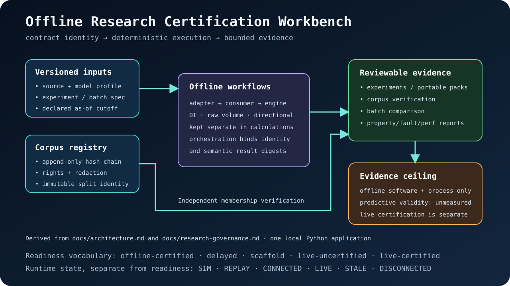

# Architecture

`gex-terminal` is organized around one rule: provider-specific data handling,
state ownership, model calculation, terminal rendering, and export/report
workflows stay separated.

## Repository Map

| Path | Architectural role |
| --- | --- |
| `gex_terminal/` | Installable application package and all runtime, model, and report modules |
| `gex_terminal/adapters/` | Provider protocol and replay implementations behind the normalized adapter boundary |
| `gex_terminal/data/` | Packaged synthetic replays and sanitized provider fixtures |
| `tests/` | Contract, model, provider, TUI, report, package, and documentation regression tests |
| `docs/` | Canonical technical, workflow, governance, decision, and packet documentation |
| `assets/` | Derived screenshots, diagrams, and product mockups; never canonical system truth |
| `main.py` | Backward-compatible wrapper around the package CLI |
| `pyproject.toml` | Package identity, dependencies, extras, and console entry point |
| `.env.example` | Provider and runtime configuration template; real credentials stay local |

The documentation ownership map is [docs/README.md](README.md). Release history
is in [CHANGELOG.md](../CHANGELOG.md), and future sequencing is in
[ROADMAP.md](../ROADMAP.md).

## Runtime Components

| Layer | Files | Responsibility |
| --- | --- | --- |
| CLI orchestration | `gex_terminal/cli.py` | Parse command-line options, load config, select runtime mode, start adapters, run exports, and coordinate shutdown. |
| Configuration | `gex_terminal/config.py` | Read the invocation directory's `.env` and environment defaults into a typed `GexConfig`. |
| Provider adapters | `gex_terminal/adapters/`, `gex_terminal/market_data_adapter.py`, `gex_terminal/contracts.py` | Convert live, delayed, provider-shaped, or replay payloads into versioned normalized messages with contract identity and timing semantics. |
| Provider certification | `gex_terminal/tradovate_certification.py`, `gex_terminal/databento_certification.py` | Run acknowledged, bounded, redacted live-network gates without converting fixture evidence into a live claim. |
| Provider fixture and replay intake | `gex_terminal/provider_injector.py`, `gex_terminal/databento_offline.py` | Route provider-shaped local records through production mapping and adversarial checks without opening a live connection. |
| State consumer | `gex_terminal/consumer.py` | Own spot, provider-scoped contract positions, projections, expiry selection, lifecycle, and feed-quality state behind an async lock. |
| GEX model | `gex_terminal/engine.py`, `gex_terminal/regime.py`, `gex_terminal/model_evidence.py` | Price Black-Scholes/Black-76 contract rows, aggregate dollar GEX, derive structural levels, and export bounded numerical evidence. |
| Evaluation models | `gex_terminal/model_comparison.py`, `gex_terminal/position_model_comparison.py`, `gex_terminal/price_action_validation.py` | Compare separated position models and descriptive later-price paths without promoting predictive validity. |
| Research authority | `gex_terminal/model_profiles.py`, `gex_terminal/experiment_manifest.py`, `gex_terminal/research_corpus.py` | Validate versioned assumptions, bind experiments to content identities, and maintain append-only corpus registration. |
| Certification gates | `gex_terminal/model_properties.py`, `gex_terminal/provider_fault_lab.py`, `gex_terminal/performance_lab.py` | Exercise numerical properties, provider-shaped fault states, and explicit generated-chain performance budgets. |
| Terminal UI | `gex_terminal/tui.py`, `gex_terminal/gex_terminal.tcss` | Render metrics, matrix rows, first-run guidance, replay browser, model-assumption controls, feed quality, event log, and exports. |
| Offline labs | `gex_terminal/replay_lab.py`, `gex_terminal/demo_lab.py`, `gex_terminal/provider_fixture_lab.py`, `gex_terminal/batch_comparison.py` | Produce replay, demo, provider-fixture, and multi-session model-comparison reports without live credentials. |
| Research/export tools | `gex_terminal/snapshot_formats.py`, `gex_terminal/overlays.py`, `gex_terminal/sensitivity.py`, `gex_terminal/research_journal.py`, `gex_terminal/session_store.py`, `gex_terminal/session_capture.py` | Save snapshots, overlays, model-sensitivity reports, journal entries, historical records, and integrity-checked normalized sessions. |
| Packaged data | `gex_terminal/data/`, `gex_terminal/package_data.py` | Resolve bundled replay and sanitized provider resources independently of the current working directory. |

## Adapter-Consumer Boundary

Adapters emit versioned underlying and option-quantity messages into
`StatefulGexConsumer`. The canonical contract implementation is
`gex_terminal/market_data_adapter.py` plus `gex_terminal/contracts.py`; the
complete documented message shapes and provider extension rules live in
[Market-Data Adapters](adapters.md).

The boundary preserves provider-scoped contract identity, event time, expiry,
quantity semantics, position source, IV provenance, multiplier, and optional
trade-direction provenance. Mutable state is keyed by provider, contract, and
position source. Incremental values accumulate, cumulative values replace, and
open interest is never summed with trade volume. Contract rows are priced before
equal strikes are aggregated.

Schema v1 remains a legacy replay path; schema v2 is the contract-aware path.
Validation, filtering, pricing-model routing, IV provenance, and direction rules
belong to the adapter and model topic guides rather than this component map.

## First-Run Flow

The default first-run path is designed to be useful without credentials.

```text
gex-terminal --demo
        |
        v
seeded demo state -> terminal renders immediately
        |
        v
press p
        |
        v
TUI opens replay browser -> Up/Down choose session -> Enter loads JSONL
        |
        v
press x/d/m/i to adjust expiry/model controls, press e to export, or use CLI reports
```

In demo mode, the in-terminal replay browser starts with `zero-gamma-flip`
because that session shows a clear regime transition. The selector uses the
same normalized message contract as the replay adapter, so UI polish remains
covered by the same consumer and engine path as offline regression tests.

The selector is intentionally limited to demo and replay mode. Live provider
tasks may be running in the background, so live mode keeps replay loading out of
the active session.

## Live Provider Flow

```text
gex-terminal --mode live --provider tradovate --symbol ES
        |
        v
CLI validates mode/provider/config
        |
        v
adapter streams provider payloads
        |
        v
adapter normalizes frames and records provider diagnostics
        |
        v
consumer updates state and feed-quality counters
        |
        v
engine computes snapshots on refresh
        |
        v
TUI displays structure, lifecycle state, and feed health
```

Live adapters should never write credentials to logs, snapshots, fixtures, or
reports. Captured provider payloads must be sanitized before they become tests
or documentation examples.

Tradovate is still a scaffold. Its official-protocol implementation waits for
raw-token authorization and subscription acknowledgements, but only the
explicit, redacted `tradovate-certify --ack-live-network` workflow can measure a
credential/environment/run window. Fixture success cannot promote registry
status or establish native-IV availability.

Databento is `live-uncertified`: one official SDK session combines
definition replay, ES/NQ option trades, and a continuous-futures `mbp-1` quote.
The adapter performs provider joining and Black-76 IV inversion before emitting
schema-v2 messages; the consumer remains the sole owner of mutable contract
state. Only `databento-certify --ack-live-network` can measure one credential,
entitlement set, symbol, and bounded run window.

## Offline Research Flow

Offline tools reuse the same adapter, consumer, and engine boundaries through
five paths:

- **Normalized replay and capture:** packaged/local normalized events and
  integrity-checked captures enter through replay adapters and event-time
  controls. A capture cannot switch replay streams mid-file.
- **Provider-shaped intake:** provider injection, fixture labs, and offline
  Databento certification reuse production mapping without opening a live
  connection or promoting readiness.
- **Model evaluation:** sensitivity, numerical evidence, position-model
  comparison, and descriptive later-price evaluation derive bounded artifacts
  from the selected source state.
- **Governed research:** model profiles, experiment manifests, append-only
  corpus registration, and batch comparison bind source identity, assumptions,
  splits, outcomes, costs, and semantic results.
- **Presentation and local storage:** replay/demo labs, journals, session stores,
  snapshots, and overlays present or retain derived state without becoming the
  canonical input authority.

The [documentation map](README.md) routes each workflow to its command and
artifact reference.

Generated output stays local by default under ignored folders such as
`demo_lab/`, `demo_pack/`, `research_journal/`, and `historical_sessions/`.



Provider readiness is not runtime connection status. The readiness vocabulary
is `offline-certified`, `delayed`, `scaffold`, `live-uncertified`, and
`live-certified`. Runtime state remains `SIM`, `LIVE`, `STALE`, or
`DISCONNECTED`; a live connection never promotes readiness by itself.

## State Ownership

`StatefulGexConsumer` is the only layer that should mutate market state. It
owns:

- `current_spot` and `session_open`
- aggregate `chain_state`
- provider-scoped `contract_state` keyed by contract identity and position source
- optional per-expiry `expiry_state`
- lifecycle timestamps
- provider and feed-quality counters
- subscription and entitlement status

Use `reset_state(...)` before loading a new offline session into an existing
terminal app. That clears market data and quality counters behind the same lock
used by live updates.

## Contributor Boundaries

- Add provider protocol code inside `gex_terminal/adapters/`.
- Keep provider live-gate logic in the certification modules and provider-shaped
  offline intake in the injector/offline modules.
- Keep normalized message changes compatible with `StatefulGexConsumer`, the
  sole owner of mutable market state.
- Put pricing and structural-level changes in `engine.py` or `regime.py`;
  comparison, evaluation, IV, or profile changes belong in their focused model
  modules. Add independent oracles, deterministic fixtures, and the applicable
  evidence coverage.
- Keep terminal presentation changes in `tui.py` and `gex_terminal.tcss`.
- Keep artifact format changes in the relevant export/report module.
- Update README only for user-facing workflows; put implementation detail in
  docs like this one.

## Verification Map

| Change area | Suggested tests |
| --- | --- |
| Consumer lifecycle or feed quality | `tests/test_gex_consumer.py`, `tests/test_feed_quality.py` |
| Model math or structural levels | `tests/test_gex_engine.py`, `tests/test_engine_structure.py`, `tests/test_regime.py` |
| TUI table or first-run behavior | `tests/test_tui_table.py`, `tests/test_tui_first_run.py`, `tests/test_demo_lab.py` |
| Replay/lab/report behavior | `tests/test_replay_lab.py`, `tests/test_demo_lab.py`, `tests/test_research_journal.py`, `tests/test_session_store.py` |
| Capture integrity or event clocks | `tests/test_session_capture.py`, `tests/test_replay_adapter.py` |
| Provider mapping | `tests/test_provider_injector.py`, `tests/test_provider_fixture_lab.py`, provider-specific adapter tests |
| Provider certification or readiness | `tests/test_tradovate_certification.py`, `tests/test_databento_certification.py`, `tests/test_provider_readiness.py` |
| Offline Databento or outcome evaluation | `tests/test_databento_offline.py`, `tests/test_position_model_comparison.py`, `tests/test_price_action_validation.py` |
| Snapshot/overlay exports | `tests/test_snapshot_formats.py`, `tests/test_overlays.py` |
| Model evidence or sensitivity parity | `tests/test_model_evidence.py`, `tests/test_sensitivity.py` |
| Experiment/corpus contracts | `tests/test_model_profiles.py`, `tests/test_experiment_manifest.py`, `tests/test_research_corpus.py` |
| Batch/property/fault/performance gates | `tests/test_batch_comparison.py`, `tests/test_offline_certification_extensions.py` |
| Wheel resources and release metadata | `tests/test_release_contract.py`, CI installed-wheel smoke workflow |
