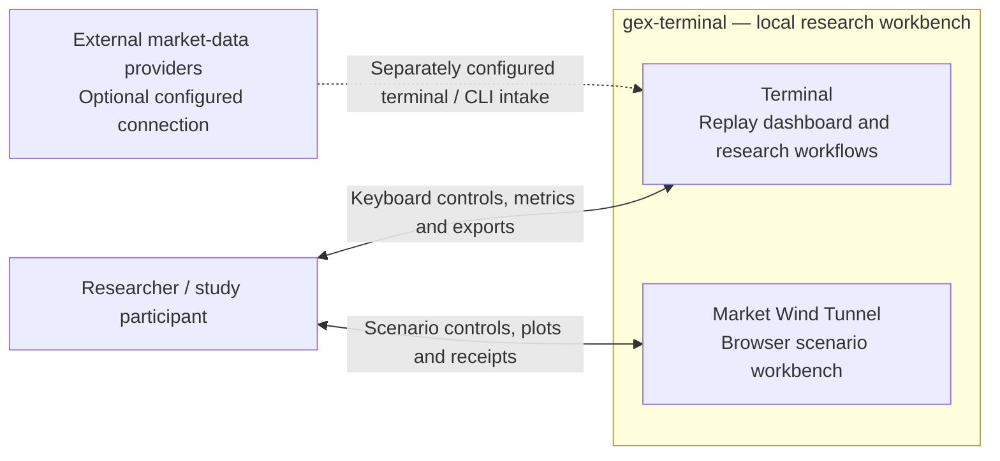
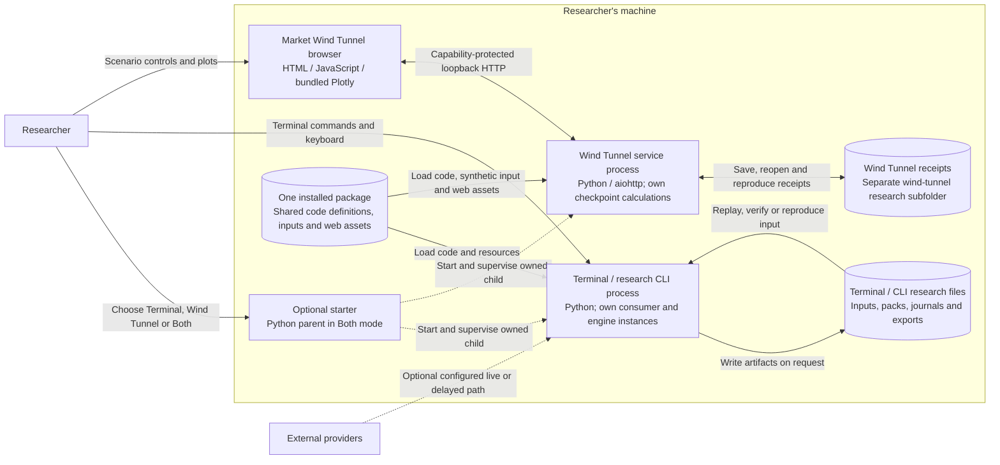
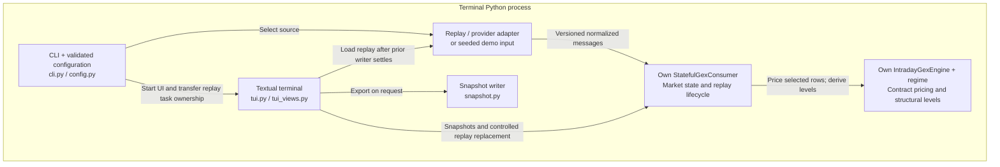
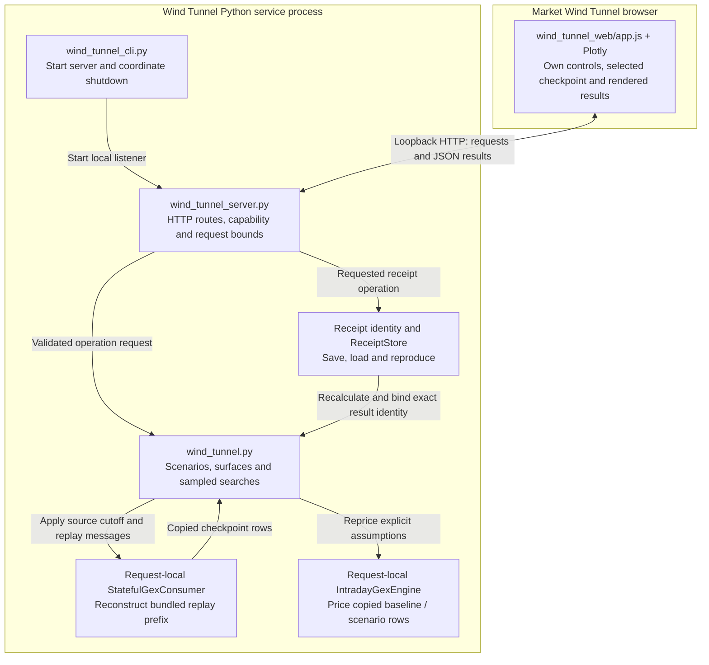
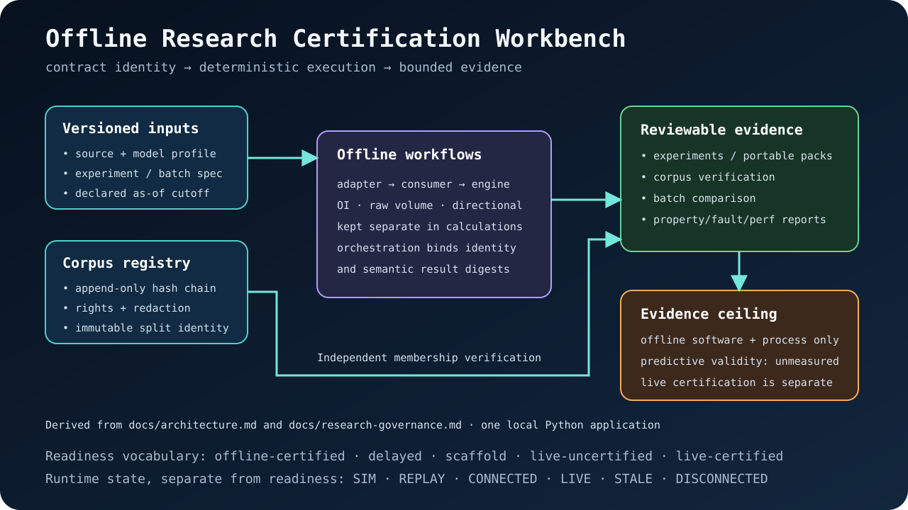

# Architecture

`gex-terminal` has two user-facing components: **Terminal**, a Textual dashboard
for replay and research workflows, and **Market Wind Tunnel**, a browser
workbench for exploring synthetic replay scenarios. They use one installed
Python package and the same calculation code, but run in separate processes
with separate state. The optional starter opens either component or manages
both together.

Provider-specific data handling, state ownership, model calculation,
presentation, and export/report workflows stay separated. Starting both
interfaces does not synchronize their source, replay checkpoint, model controls
or scenario selections.

This document owns the current architecture, including the C4 views below.
The diagrams describe shipped source; roadmap items and product concepts are
not deployed components. The [visual asset guide](../assets/README.md) records
the source and purpose of the derived SVGs.

## C4 Views

### System Context

The researcher operates one local workbench through two interfaces. Terminal
provides a replay dashboard and access to research workflows; Market Wind Tunnel
provides scenario controls, exposure plots and saved experiments. Synthetic
replay, calculation, comparison, export, and reproduction require no provider
connection. Optional provider connections belong to separately configured
terminal/CLI paths; Wind Tunnel accepts bundled synthetic sources only.


```mermaid
flowchart LR
    researcher["Researcher / study participant"]
    subgraph workbench["gex-terminal — local research workbench"]
        terminal["Terminal<br/>Replay dashboard and research workflows"]
        wind["Market Wind Tunnel<br/>Browser scenario workbench"]
    end
    providers["External market-data providers<br/>Optional configured connection"]
    researcher <-->|Keyboard controls, metrics and exports| terminal
    researcher <-->|Scenario controls, plots and receipts| wind
    providers -.->|Separately configured terminal / CLI intake| terminal
```

Provider availability, credentials, rights, and readiness are documented in
[Market-Data Adapters](adapters.md). The study build uses the offline path in
[Study Build](study-build.md); participant observations remain separate from
software verification.

### Containers And Local Storage

The installed package supports separate local runtime containers. Terminal runs
in a Python process with its Textual UI, intake task, consumer and engine.
Market Wind Tunnel consists of browser code and a separate Python service with
an aiohttp listener bound to `127.0.0.1`. Its checkpoint consumers and scenario
calculations live in that service process, not in Terminal. Research CLI
commands select their own workflow in a separate invocation of the same package.

In Both mode, the setup helper remains a parent process supervising the two
application children. The browser is an independently managed application;
the starter requests that it open the local launch URL. Installed resources and
research files are storage boundaries, not running services. There is no hosted
API, external chart service or database in this architecture.


```mermaid
flowchart LR
    researcher["Researcher"]
    providers["External providers"]
    subgraph local["Researcher's machine"]
        starter["Optional starter<br/>Python parent in Both mode"]
        terminal["Terminal / research CLI process<br/>Python; own consumer and engine instances"]
        browser["Market Wind Tunnel browser<br/>HTML / JavaScript / bundled Plotly"]
        wind["Wind Tunnel service process<br/>Python / aiohttp; own checkpoint calculations"]
        package[("One installed package<br/>Shared code definitions, inputs and web assets")]
        files[("Terminal / CLI research files<br/>Inputs, packs, journals and exports")]
        receipts[("Wind Tunnel receipts<br/>Separate wind-tunnel research subfolder")]
    end
    researcher -->|Choose Terminal, Wind Tunnel or Both| starter
    researcher -->|Terminal commands and keyboard| terminal
    researcher -->|Scenario controls and plots| browser
    starter -.->|Start and supervise owned child| terminal
    starter -.->|Start and supervise owned child| wind
    browser <-->|Capability-protected loopback HTTP| wind
    package -->|Load code and resources| terminal
    package -->|Load code, synthetic input and web assets| wind
    files -->|Replay, verify or reproduce input| terminal
    terminal -->|Write artifacts on request| files
    wind <-->|Save, reopen and reproduce receipts| receipts
    providers -.->|Optional configured live or delayed path| terminal
```

The repeated consumer and engine instances use the same installed code; there
is no shared in-memory market state or Terminal-to-Wind Tunnel data connection.
Configuration for terminal/CLI workflows is loaded locally by `config.py`;
provider secrets remain outside the package and research artifacts. Installation
uses Python package dependencies, while running the frozen replay study and
Wind Tunnel needs no data-provider I/O. The package/resource boundary is verified
from a wheel outside the checkout.

The optional setup helper, `scripts/install_app.py`, installs an explicitly
supplied wheel into an owned application folder. It verifies a fresh environment
before changing the active launch target and keeps research in a separate
directory. `scripts/build_app_bundle.py` prepares a local handoff containing that
helper, the wheel and an optional dependency wheelhouse. The builder is a setup
tool; the installed helper also supplies the starter and Both supervisor. Neither
is a hosted service or package registry. The generated offline launcher
initializes configuration in an empty working directory with provider settings
excluded, then writes requested exports in the selected research directory.
Direct `gex-terminal` invocations retain their existing configuration behavior.

Fresh Wind Tunnel-capable setup folders offer Terminal, Wind Tunnel or Both
through the starter. Both starts its background Wind Tunnel child first, waits
for the service's launch URL, requests a browser window, then starts its
foreground terminal child. Server output stays off the terminal UI. Quitting
Terminal stops only that combined session's Wind Tunnel service; an interruption
or service failure settles both owned children. It does not stop another launch
or close the user's browser. Closing a browser tab alone does not stop the
service. A startup failure cancels Both before Terminal opens. Separate launches
remain independent. Existing installer receipts retain their original launcher
bytes; the setup manifest identifies the installer commit separately when it
reuses a wheel from another source commit.

The Wind Tunnel reconstructs a declared synthetic replay checkpoint in a fresh
consumer for each calculation request. It copies checkpoint rows, applies
scenario assumptions and prices those copies with the existing engine code.
Its service exposes only bundled source identifiers and bounded operations,
never arbitrary input paths. An origin check and per-run capability protect the
API; the capability stays outside saved research. Static browser assets are
packaged with the wheel, so no external script or chart service is required.
Receipts bind normalized requests, exact source and calculation identities,
and semantic results. Reproduction recalculates before declaring agreement.

### Application Components

This view expands the two Python application processes and the browser client.
Arrows name calls or data flow inside those boundaries, with HTTP as the browser
boundary. The two consumer and engine boxes are separate instances of the same
classes, not a common runtime service. Other research commands reuse those
classes in their own CLI invocation.

**Terminal components**


```mermaid
flowchart TB
    subgraph terminal["Terminal Python process"]
        cli["CLI + validated configuration<br/>cli.py / config.py"]
        intake["Replay / provider adapter<br/>or seeded demo input"]
        consumer["Own StatefulGexConsumer<br/>Market state and replay lifecycle"]
        engine["Own IntradayGexEngine + regime<br/>Contract pricing and structural levels"]
        tui["Textual terminal<br/>tui.py / tui_views.py"]
        exports["Snapshot writer<br/>snapshot.py"]
        cli -->|Select source| intake
        cli -->|Start UI and transfer replay task ownership| tui
        intake -->|Versioned normalized messages| consumer
        consumer -->|Price selected rows; derive levels| engine
        tui -->|Snapshots and controlled replay replacement| consumer
        tui -->|Load replay after prior writer settles| intake
        tui -->|Export on request| exports
    end
```

**Market Wind Tunnel browser and service components**


```mermaid
flowchart TB
    subgraph browser["Market Wind Tunnel browser"]
        web["wind_tunnel_web/app.js + Plotly<br/>Own controls, selected checkpoint and rendered results"]
    end
    subgraph service["Wind Tunnel Python service process"]
        windcli["wind_tunnel_cli.py<br/>Start server and coordinate shutdown"]
        server["wind_tunnel_server.py<br/>HTTP routes, capability and request bounds"]
        core["wind_tunnel.py<br/>Scenarios, surfaces and sampled searches"]
        checkpoint["Request-local StatefulGexConsumer<br/>Reconstruct bundled replay prefix"]
        pricing["Request-local IntradayGexEngine<br/>Price copied baseline / scenario rows"]
        receipts["Receipt identity and ReceiptStore<br/>Save, load and reproduce"]
        windcli -->|Start local listener| server
        server -->|Validated operation request| core
        core -->|Apply source cutoff and replay messages| checkpoint
        checkpoint -->|Copied checkpoint rows| core
        core -->|Reprice explicit assumptions| pricing
        server -->|Requested receipt operation| receipts
        receipts -->|Recalculate and bind exact result identity| core
    end
    web <-->|Loopback HTTP: requests and JSON results| server
```

The terminal's seeded demo writes synthetic messages directly through its
consumer rather than opening an adapter. Capture optionally wraps intake with
`RecordingConsumerProxy`; live capture first requires its approved policy
identity. The component view omits individual command helpers; the inventory
below identifies their source modules. Offline labs and governed research
commands select intake, consumers, models and artifact writers as needed;
profiles, experiment manifests and corpus rules bind their research identity.
Corpus verification and some report commands inspect files without running the
model, and are not additional writers of market state. Wind Tunnel's browser
holds interface state; its service recalculates from each declared request
instead of reading the Terminal consumer or following its replay writer.

## Repository Map

| Path | Architectural role |
| --- | --- |
| `gex_terminal/` | Installable application package and all runtime, model, and report modules |
| `gex_terminal/adapters/` | Provider protocol and replay implementations behind the normalized adapter boundary |
| `gex_terminal/data/` | Packaged synthetic replays and sanitized provider fixtures |
| `gex_terminal/wind_tunnel_web/` | Packaged browser UI, Plotly, icons and static assets served by the local Wind Tunnel service |
| `scripts/install_app.py`, `scripts/build_app_bundle.py` | Reviewed-wheel setup, generated launchers, optional Both supervisor and bundle preparation |
| `tests/` | Contract, model, provider, TUI, report, package, and documentation regression tests |
| `docs/` | Canonical technical, workflow, governance, decision, and packet documentation |
| `assets/` | Derived screenshots, diagrams, and product mockups; never canonical system truth |
| `main.py` | Backward-compatible wrapper around the package CLI |
| `pyproject.toml` | Package identity, dependencies, extras, and console entry point |
| `.env.example` | Provider and runtime configuration template; real credentials stay local |

The documentation ownership map is [docs/README.md](README.md). Release history
is in [CHANGELOG.md](../CHANGELOG.md), and future sequencing is in
[ROADMAP.md](../ROADMAP.md).

## Runtime Components

| Layer | Files | Responsibility |
| --- | --- | --- |
| CLI orchestration | `gex_terminal/cli.py` | Parse command-line options, load config, select runtime mode, start adapters, run exports, and coordinate shutdown. |
| Configuration | `gex_terminal/config.py` | Read the invocation directory's `.env` and environment defaults into a typed `GexConfig`. |
| Offline preflight | `gex_terminal/doctor.py` | Inspect local package/configuration/resources and temporary storage without a live adapter or optional SDK import; report safe structural diagnostics. |
| Local support and recovery | `gex_terminal/local_support.py`, `gex_terminal/artifact_lifecycle.py` | Separate redacted support evidence from owner-only private backups; verify whole recognized research groups and require a backup-bound, separately confirmed retention plan. |
| Provider adapters | `gex_terminal/adapters/`, `gex_terminal/market_data_adapter.py`, `gex_terminal/contracts.py` | Convert live, delayed, provider-shaped, or replay payloads into versioned normalized messages with contract identity and timing semantics. |
| Provider certification | `gex_terminal/tradovate_certification.py`, `gex_terminal/databento_certification.py`, `gex_terminal/databento_certification_policy.py` | Select a versioned target policy before I/O, run acknowledged and bounded live-network gates, and derive redacted exact-run evidence without converting fixture evidence into a live claim. |
| Provider fixture and replay intake | `gex_terminal/provider_injector.py`, `gex_terminal/databento_offline.py` | Route provider-shaped local records through production mapping and adversarial checks without opening a live connection. |
| State consumer | `gex_terminal/consumer.py` | Own spot, provider-scoped contract positions, projections, expiry selection, lifecycle, and feed-quality state behind an async lock. |
| GEX model | `gex_terminal/engine.py`, `gex_terminal/regime.py`, `gex_terminal/model_evidence.py` | Price Black-Scholes/Black-76 contract rows, aggregate dollar GEX, derive structural levels, and export bounded numerical evidence. |
| Evaluation models | `gex_terminal/model_comparison.py`, `gex_terminal/position_model_comparison.py`, `gex_terminal/price_action_validation.py` | Compare separated position models and descriptive later-price paths without promoting predictive validity. |
| Capture and research authority | `gex_terminal/capture_governance.py`, `gex_terminal/session_capture.py`, `gex_terminal/model_profiles.py`, `gex_terminal/experiment_manifest.py`, `gex_terminal/research_corpus.py` | Fail closed on ambiguous live-capture decisions, bind captures to policy identity, validate versioned assumptions, and maintain reproducible experiment and append-only corpus identity. |
| Runtime safety | `gex_terminal/logging_config.py`, `gex_terminal/redaction.py` | Configure warning-level process logging by default and recursively sanitize secrets, sensitive identifiers, and labeled private payload fields before configured log or certification output. |
| Certification gates | `gex_terminal/model_properties.py`, `gex_terminal/provider_fault_lab.py`, `gex_terminal/performance_lab.py` | Exercise numerical properties, provider-shaped fault states, and explicit generated-chain performance budgets. |
| Terminal UI | `gex_terminal/tui.py`, `gex_terminal/tui_views.py`, `gex_terminal/gex_terminal.tcss` | Render metrics, matrix rows and responsive layout; present focused replay/help views, model controls, source and quality context, event history and exports. |
| Wind Tunnel calculations | `gex_terminal/wind_tunnel.py` | Reconstruct a bundled replay cutoff with a request-local consumer, copy checkpoint rows, and use engine code to calculate baseline/scenario comparisons, surfaces and bounded searches. |
| Wind Tunnel service and CLI | `gex_terminal/wind_tunnel_server.py`, `gex_terminal/wind_tunnel_cli.py` | Serve packaged assets and bounded loopback API operations, protect requests with a per-run capability, and save/verify/reproduce receipts. CLI example and reproduction commands also run without the browser server. |
| Wind Tunnel browser | `gex_terminal/wind_tunnel_web/` | Hold source/checkpoint/scenario selections, request calculations, render Plotly views and expose receipt controls; never read the Terminal's consumer state. |
| Setup and starter | `scripts/install_app.py`, `scripts/build_app_bundle.py` | Prepare and verify an owned wheel installation, keep research separate, generate shortcuts and offer Terminal/Wind Tunnel/Both. Both supervises two application children with readiness checks and owned-process cleanup. |
| Offline labs | `gex_terminal/replay_lab.py`, `gex_terminal/demo_lab.py`, `gex_terminal/provider_fixture_lab.py`, `gex_terminal/batch_comparison.py` | Produce replay, demo, provider-fixture, and multi-session model-comparison reports without live credentials. |
| Portable research receipt | `gex_terminal/demo_lab_receipt.py` | Bind authorized copied replay, model/runtime identity, exact inventory and semantic content; reject unsupported or changed packs before reproduction. |
| Research/export tools | `gex_terminal/snapshot_formats.py`, `gex_terminal/overlays.py`, `gex_terminal/sensitivity.py`, `gex_terminal/research_journal.py`, `gex_terminal/session_store.py` | Save snapshots, overlays, model-sensitivity reports, journal entries, and historical records from normalized state. |
| Packaged data | `gex_terminal/data/`, `gex_terminal/package_data.py` | Resolve bundled replay and sanitized provider resources independently of the current working directory. |

## Adapter-Consumer Boundary

Adapters emit versioned underlying and option-quantity messages into
`StatefulGexConsumer`. The canonical contract implementation is
`gex_terminal/market_data_adapter.py` plus `gex_terminal/contracts.py`; the
complete documented message shapes and provider extension rules live in
[Market-Data Adapters](adapters.md).

The boundary preserves provider-scoped contract identity, event time, expiry,
quantity semantics, position source, IV provenance, multiplier, and optional
trade-direction provenance. Mutable state is keyed by provider, contract, and
position source. Incremental values accumulate, cumulative values replace, and
open interest is never summed with trade volume. Contract rows are priced before
equal strikes are aggregated.

Schema v1 remains a legacy replay path; schema v2 is the contract-aware path.
Validation, filtering, pricing-model routing, IV provenance, and direction rules
belong to the adapter and model topic guides rather than this component map.

## First-Run Flow

The default first-run path is designed to be useful without credentials. The
wheel installation, offline doctor and full user journey are owned by
[First Run](first-run.md). A fresh reviewed setup with the unified starter routes
the user to the two components:

```text
Install.command -> verified application environment -> Start GEX.command chooser
        |
        +-> Terminal -> its own replay consumer -> Textual dashboard
        |
        +-> Wind Tunnel -> local Python service -> browser controls and plots
        |
        +-> Both -> supervised Wind Tunnel service becomes ready
                       -> request browser window -> start Terminal child
                       -> Terminal exit stops this session's Wind Tunnel service
```

The setup launcher's Terminal path selects `zero-gamma-flip`; the direct
`gex-terminal --demo` CLI path starts seeded data. Wind Tunnel independently
selects its own bundled source and checkpoint. Both changes launch and shutdown
coordination, not either component's source or model state. Its internal terminal
flow remains:

```text
gex-terminal --demo
        |
        v
seeded demo state -> terminal renders immediately
        |
        v
press p
        |
        v
TUI opens replay browser -> Up/Down choose session -> Enter loads JSONL
        |
        v
press x/d/m/i to adjust expiry/model controls, press e to export, or use CLI reports
```

In demo mode, the in-terminal replay browser starts with `zero-gamma-flip`
because that session shows a clear regime transition. The selector uses the
same normalized message contract as the replay adapter, so UI polish remains
covered by the same consumer and engine path as offline regression tests.

Picker navigation has conditional keyboard priority: while the browser is open
on the current dashboard, its Up/Down/Enter actions run before the focused
strike table's bindings. Closing or loading releases those keys to the table;
a pushed screen retains its own bindings even if the browser remains open
behind it. Real Textual key-event regressions must exercise this routing, not
only invoke action methods. User controls belong in [First Run](first-run.md).

The selector is intentionally limited to demo and replay mode. Live provider
tasks may be running in the background, so live mode keeps replay loading out of
the active session. Active capture also blocks replacement; keyboard routing
does not bypass the loading or writer-settlement gates.

At 140×42 and above the compact layout preserves metrics, strike rows, quality
and controls, with scrolling for explanatory cards. Below the declared minimum,
an explicit message replaces the clipped dashboard; resizing restores it
without resetting market state. The large layout exposes the additional sidebar.

The dashboard screen owns its periodic and initial refresh callbacks. Refresh
work captures that owner and checks it again after snapshot and expiry awaits;
quit, teardown or another current screen prevents cache/UI publication. Resize
updates the captured dashboard even behind an overlay. Genuine render errors
on the current mounted dashboard still propagate; replay-writer ownership is
a separate boundary.

## Live Provider Flow

```text
CLI acknowledgement/configuration
        |
        v
provider adapter -> normalized messages -> StatefulGexConsumer
        |
        v
engine snapshot -> TUI/report/capture
```

Live adapters should never write credentials to logs, snapshots, fixtures, or
reports. A live capture is a separate authority boundary:

```text
capture policy (rights + retention + redaction + research use)
        |
        v
validated policy identity -> live connection -> captured-session header
        |
        v
matching approved policy + verified redaction -> corpus registration
```

The policy records an operator decision; it neither grants provider rights nor
automatically makes retained observations redistributable. The capture header
stores only policy schema, ID, and SHA-256. Corpus registration of a captured
session additionally requires a matching policy, approved research use,
matching rights/redistribution metadata, and `redaction_status=verified`.

### Databento Certification Boundary

Databento remains `live-uncertified`. Its provider path is deliberately split
into implementation authority and exact-run evidence:

```text
ES/NQ target -> versioned certification policy -> DatabentoAdapter
        |
        v
required requests + optional statistics request -> provider records
        |
        v
consumer state + adapter diagnostics -> redacted certification report
```

The three required requests are `definition`, `mbp-1`, and `trades`; the
`statistics` open-interest request is optional. The SDK's returned integers are
local request IDs. They show that a request returned without a synchronous
exception; they are not provider acknowledgements. Actual records, distinct
chain coverage, and explicit errors supply the observation evidence.

The offline `live_population_contract` module is a preparation boundary around
future recurring observation, not another adapter or runner. It validates a
complete 12-slot ES plan, hashes the registered certification policy and every
normalized plan field, and cross-checks a later hand-authored redacted result
manifest against that frozen population. It has no credential, scheduling,
capture, or network integration. Report digests are declared identities only;
the validator does not read or authenticate report bytes. See
[Live Population Preparation](live-population-prep.md).

The adapter requests the SDK reconnect policy and registers a reconnect
callback. Diagnostics count callback boundaries and the first frame observed
after each boundary. A post-callback frame is useful resumption evidence, but it
does not acknowledge each schema or prove provider-side resubscription. No
reconnect event is required to pass a window that did not disconnect.

Trade records carry venue sequence values even though `trades` is only a subset
of the venue event stream. Nonconsecutive values and duplicates are therefore
reported descriptively. The certification integrity gate uses the provider's
maybe-bad-book flag and observed out-of-order records; it does not reinterpret
every numeric discontinuity as feed loss.

Shutdown is bounded around the pinned SDK's nonblocking `stop()` contract and
its awaitable `wait_for_close()`. Awaitable stop implementations are also
bounded. Closure must complete within the time limit for `clean_stop=true`; a
timeout triggers the termination fallback and records a stop error. The outer
certification task also has a bounded cancellation grace period.

Tradovate is still a scaffold. Its official-protocol implementation waits for
raw-token authorization and subscription acknowledgements, but only the
explicit, redacted `tradovate-certify --ack-live-network` workflow can measure a
credential/environment/run window. Fixture success cannot promote registry
status or establish native-IV availability.

Only `databento-certify --ack-live-network` can measure one credential,
entitlement set, symbol, and bounded run window. The ES and NQ policies are
separate and enforce their canonical multipliers. Their thresholds are
repository-owned fail-closed choices, not an empirical definition of sufficient
market coverage. Open interest is separately reported as observed, unavailable,
unsupported, entitlement-denied, or not requested; it is never replaced by or
summed with trade volume. Detailed mapping and policy values live in
[Databento Fixture Mapping](databento-fixtures.md).

## Offline Research Flow

Offline tools reuse the same adapter, consumer, and engine code boundaries
through six paths, with consumer instances owned by the invoking workflow:

- **Normalized replay and capture:** packaged/local normalized events and
  integrity-checked captures enter through replay adapters and event-time
  controls. A capture cannot switch replay streams mid-file. Live capture
  additionally passes the capture-policy gate before provider startup.
  Consumer acceptance determines analytical timeline membership; rejected input
  remains only in counters/raw-input audit. Snapshot as-of follows accepted
  state, not the final raw record's timestamp.
- **Provider-shaped intake:** provider injection, fixture labs, and offline
  Databento certification reuse production mapping without opening a live
  connection or promoting readiness.
- **Model evaluation:** sensitivity, numerical evidence, position-model
  comparison, and descriptive later-price evaluation derive bounded artifacts
  from the selected source state.
- **Wind Tunnel scenarios:** each request reconstructs a bundled synthetic
  checkpoint, copies its rows and applies explicit spot, IV, time and expiry
  assumptions. Browser comparisons, surfaces and sampled searches use those
  copied inputs; they neither consume Terminal's active replay nor fabricate a
  future market path. Saved receipts retain the normalized request and exact
  source, calculation and result identities for reproduction.
- **Governed research:** model profiles, experiment manifests, append-only
  corpus registration, and batch comparison bind source identity, assumptions,
  splits, outcomes, costs, and semantic results.
- **Presentation and local storage:** replay/demo labs, journals, session stores,
  snapshots, and overlays present or retain derived state without becoming the
  canonical input authority.

The [documentation map](README.md) routes each workflow to its command and
artifact reference.

### Portable identity and local authority

Demo Lab v2 extends the existing pack rather than introducing a second research
format. Its receipt binds the copied authorized synthetic input, catalog
instrument/multiplier, model profile, explicit runtime compatibility and exact
file inventory. Reproduction reads that copied source and compares five decision
artifacts after removing only declared volatile timing fields. Different
instruments are grouped separately; ES/NQ differences are not model deltas.
The [Demo Lab contract](demo-lab.md) owns schema and command details.

Experiment manifests independently bind full specification and profile identity,
input, implementation, evidence policy and semantic result. Legacy v1 verification
is explicitly partial. Corpus verification checks membership and content
integrity, not point-in-time evaluation eligibility; it never promotes a stored
input merely because a hash matches. [Research Governance](research-governance.md)
owns these identity and cutoff contracts. Unkeyed hashes provide internal
consistency, not signatures or independent historical authenticity.

Bundled replay catalog entries own instrument identity (symbol and fallback
multiplier); a shared configuration resolver carries it into each offline
workflow. The legacy seeded demonstration is ES-only. Consumer calculations
attach selected-row multiplier provenance to snapshots, keeping effective
inputs distinct from the compatibility fallback field; see
[Export Formats](exports.md#snapshot-json) for the additive snapshot contract.

Generated output stays local by default under ignored folders such as
`demo_lab/`, `demo_pack/`, `research_journal/`, and `historical_sessions/`.



This SVG is a derived summary of this section and
[Research Governance](research-governance.md). Experiment/receipt orchestration
owns result identity; the consumer and engine do not create manifests or semantic
digests. Corpus registration is an independently verified registry, not an
automatic prerequisite or selector for every experiment.

Provider readiness is not runtime connection status. The readiness vocabulary
is `offline-certified`, `delayed`, `scaffold`, `live-uncertified`, and
`live-certified`. Runtime state includes `SIM`, `REPLAY`, `CONNECTED`, `LIVE`,
`STALE`, and `DISCONNECTED`; a live connection never promotes readiness by itself.
Provider-shaped injection is `REPLAY` with a disconnected transport and explicit
offline/no-network origin. Scripted fault tests may model live transitions, but
remain marked as simulations. Frozen `GexConfig` validates numeric values at
construction/replacement; UI updates validate before publishing state changes.

## State Ownership

Each `StatefulGexConsumer` instance owns its invocation's mutable market state.
The class defines the state-owner boundary; it is not a global object shared by
Terminal, Wind Tunnel and research commands. An instance owns:

- `current_spot` and `session_open`
- aggregate `chain_state`
- provider-scoped `contract_state` keyed by contract identity and position source
- optional per-expiry `expiry_state`
- lifecycle timestamps
- provider and feed-quality counters
- subscription and entitlement status

The CLI gives the terminal ownership of its active replay writer task. Replay
replacement is serialized and cancels/awaits that writer before calling
`reset_state(...)`; only after adapter cleanup may new input enter. A failed
writer blocks replacement and remains visible at CLI shutdown. Reset clears
market data and quality counters behind the same lock used by updates. Capture
and live-source sessions cannot switch replay.

Wind Tunnel creates its own consumer when reconstructing the selected replay
prefix for a calculation request. It then copies the checkpoint rows for
scenario pricing, preserving the source checkpoint. Browser control state and
calculated responses belong to that browser view; they do not replace Terminal's
consumer, replay task or selected model. The Both supervisor owns process
lifetime only and provides no shared-memory or replay-synchronization channel.

## Contributor Boundaries

- Add provider protocol code inside `gex_terminal/adapters/`.
- Keep provider live-gate logic in the certification modules and provider-shaped
  offline intake in the injector/offline modules.
- Keep certification target identity and thresholds in the versioned policy
  module; do not hide threshold changes in a report formatter or adapter.
- Use the central logging and redaction modules for process output. Keep
  capture/corpus authority in the governance modules rather than inferring it
  from provider readiness or file integrity.
- Keep normalized message changes compatible with `StatefulGexConsumer`, the
  sole owner of mutable market state.
- Put pricing and structural-level changes in `engine.py` or `regime.py`;
  comparison, evaluation, IV, or profile changes belong in their focused model
  modules. Add independent oracles, deterministic fixtures, and the applicable
  evidence coverage.
- Keep terminal presentation changes in `tui.py`, `tui_views.py` and `gex_terminal.tcss`.
- Keep Wind Tunnel browser presentation in `wind_tunnel_web/`, request/receipt
  boundaries in `wind_tunnel_server.py`, and synthetic scenario orchestration in
  `wind_tunnel.py`. Reuse engine pricing rather than duplicating it in JavaScript.
- Keep setup, chooser and owned-process supervision in `scripts/install_app.py`;
  do not use the starter to transfer market state between the two interfaces.
- Keep artifact format changes in the relevant export/report module.
- Update README only for user-facing workflows; put implementation detail in
  docs like this one.
- Keep these C4 views, the component inventory, and derived architecture assets
  consistent in the same change whenever a source or ownership boundary changes.
  Record architectural decisions in `docs/decisions/`; record future sequencing
  in the roadmap and completed delivery in the changelog or closed packet.

## Verification Map

| Change area | Suggested tests |
| --- | --- |
| Consumer lifecycle or feed quality | `tests/test_gex_consumer.py`, `tests/test_feed_quality.py` |
| Model math or structural levels | `tests/test_gex_engine.py`, `tests/test_engine_structure.py`, `tests/test_regime.py` |
| TUI table or first-run behavior | `tests/test_tui_table.py`, `tests/test_tui_first_run.py`, `tests/test_demo_lab.py` |
| Wind Tunnel numerical, service or CLI behavior | `tests/test_wind_tunnel.py`, `tests/test_wind_tunnel_server.py`, `tests/test_wind_tunnel_cli.py`; inspect the browser against computed results |
| Replay/lab/report behavior | `tests/test_replay_lab.py`, `tests/test_demo_lab.py`, `tests/test_research_journal.py`, `tests/test_session_store.py` |
| Capture integrity, policy, or event clocks | `tests/test_session_capture.py`, `tests/test_capture_governance.py`, `tests/test_replay_adapter.py` |
| Provider mapping | `tests/test_provider_injector.py`, `tests/test_provider_fixture_lab.py`, provider-specific adapter tests |
| Provider certification, policy, lifecycle, or readiness | `tests/test_tradovate_certification.py`, `tests/test_databento_certification.py`, `tests/test_databento_certification_policy.py`, `tests/test_databento_live.py`, `tests/test_provider_readiness.py` |
| Prospective live-population preparation | `tests/test_live_population_contract.py` |
| Offline Databento or outcome evaluation | `tests/test_databento_offline.py`, `tests/test_position_model_comparison.py`, `tests/test_price_action_validation.py` |
| Snapshot/overlay exports | `tests/test_snapshot_formats.py`, `tests/test_overlays.py` |
| Model evidence or sensitivity parity | `tests/test_model_evidence.py`, `tests/test_sensitivity.py` |
| Experiment/corpus contracts | `tests/test_model_profiles.py`, `tests/test_experiment_manifest.py`, `tests/test_research_corpus.py` |
| Logging and recursive redaction | `tests/test_safety_controls.py` |
| Batch/property/fault/performance gates | `tests/test_batch_comparison.py`, `tests/test_offline_certification_extensions.py` |
| Wheel resources and release metadata | `tests/test_release_contract.py`, CI installed-wheel smoke workflow |
| Reviewed-wheel setup and launch handoff | `tests/test_install_app.py`, `tests/test_app_bundle.py`, `tests/test_starter.py`; fresh-folder installation, reuse and managed-child lifecycle checks |
| Maintainer preview automation | `tests/test_refresh_previews.py`; staged synthetic previews and local provenance manifest |
| Retained CI evidence | `tests/test_ci_evidence.py`; bounded synthetic inventory and explicit failed/missing outputs |
| Documentation paths and heading destinations | `tests/test_release_contract.py` (`DocumentationLinkContractTests`) |

The [offline CI workflow](offline-ci.md) exercises source, installed-wheel and
recovery paths on Linux/macOS and Python 3.11/3.12. Maintainer scripts generate
preview and build-evidence artifacts outside runtime state ownership. These are
verification tools; the C4 application/deployment boundaries are unchanged.

For diagrams, also inspect the rendered Mermaid and SVG layout. A passing link
check cannot establish that an architectural relationship matches source code.
