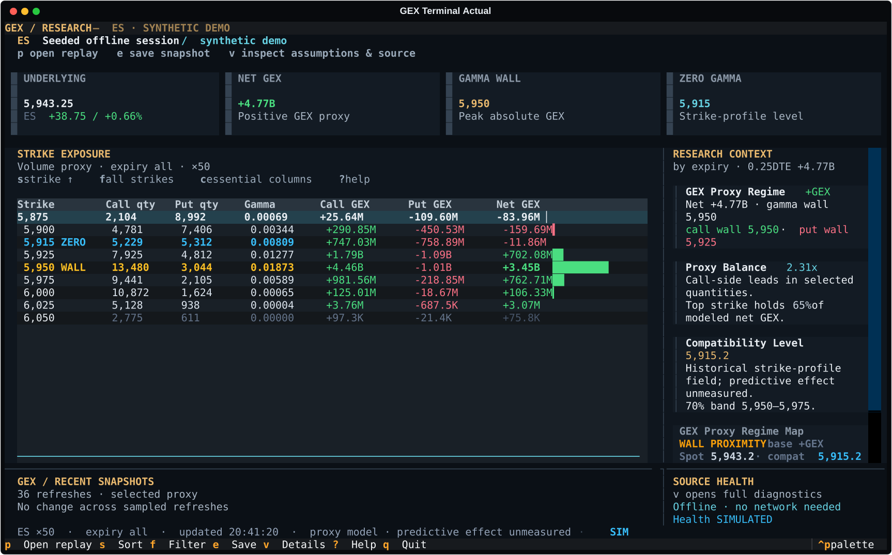
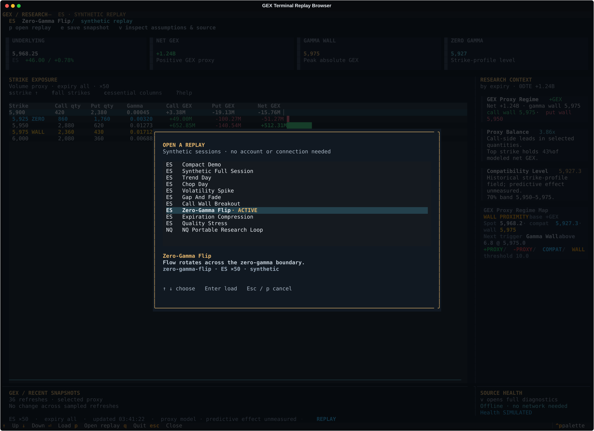

# Deployment And Terminal Experience Review

Review date: September 26, 2026. Baseline: `f4df041`.
[GEX-UX-002](work-packets/GEX-UX-002.md) owns implementation and exact verification
status. The scope is the existing local terminal, from setup through selecting
and inspecting a synthetic replay and saving a snapshot.

## Findings And Changes

| Step | Baseline finding | Implemented response |
| --- | --- | --- |
| 1. Install and return | Several manual commands, repeated environment activation, and ambient `.env` configuration obstruct first launch. A wheel alone lacks dependencies. | A supplied setup folder checks the wheel, verifies installation and creates a reusable offline launcher. Optional platform-specific dependency wheels permit setup without downloads. Research stays separate. |
| 2. Open the dashboard | At 120×40 the dashboard is entirely replaced by resize guidance. At 180×54 secondary diagnostics and a static symbol rail compete with the data; metric notes are clipped. | Four primary metrics, persistent instrument/source and action guidance, clearer amber/cyan hierarchy and essential columns at 100×32. Full columns and detailed context remain reachable. |
| 3. Choose a replay | At 140×42 the selected catalog entry can be below the visible panel. | A focused dialog keeps the selected row visible, labels the active replay and shows the selected instrument, multiplier and description. Cancel restores table focus. |
| 4. Inspect results | Ordinary refresh returns selection to row zero. Some labels call volume OI or imply that a compatibility field predicts a volatility change. | Selection follows strike identity through refresh, sort and responsive column changes. Quantity/source labels and strike-profile wording preserve the existing model meaning. Help and Details keep assumptions and health accessible. |
| 5. Save a snapshot | Second-resolution names can collide, while the event log shows only a basename. | Distinct save names, visible completion feedback and a retained absolute destination in Details. The setup launcher writes to its research folder. |

The dashboard also labels unchanged sampled values instead of drawing a full
sparkline band. A refresh is not a new market observation. Positive/negative
values keep signs and text labels as well as color.

## Current Screens

Dashboard using packaged synthetic data:

Focused replay chooser:

These are actual Textual captures, not concepts or live-market evidence.
[Visual Assets](../assets/README.md) owns their source and reproduction notes.
Fresh baseline and final comparison captures are retained locally under ignored
`dist/deployment-ux-review/`. Baseline and final demo comparisons use the same
180×54, 120×40 and 140×42 dimensions and command arguments. Additional final
checks cover 100×32, 120×36 and the help/details dialogs. Color captures use a
scrubbed environment; the running app still respects `NO_COLOR`.

## Setup Review

The simplest handoff is a reviewed folder containing a wheel, installer and
`Install.command`. Opening it on macOS or running it with `sh` on Linux performs
setup. Later starts use the generated launcher. [First Run](first-run.md) owns
the exact steps, manual alternative and recovery instructions.

The helper checks the supplied wheel hash and installed application payload
before importing application code. A successful fresh environment must pass
dependency checks, offline doctor and a bundled replay export before it becomes
active. Failed updates preserve the previous active receipt and launcher bytes.
Unknown or modified installation state fails rather than being overwritten.

The local installation rehearsal uses a complete macOS ARM64 / CPython 3.12
wheelhouse with downloads disabled, contaminated caller/research `.env` files,
separate research sentinels, repeat setup and ES/NQ exports. Source tests also
exercise changed payload, malformed receipt, failed publication, wrong wheel
and existing-folder cases. CI contains the same setup entry point on Linux and
macOS; configured checks are not evidence of a hosted run until that run passes.

## Remaining Limits

Python 3.11 or 3.12 is still required. This is a local Python application with
convenience launchers, not a signed native binary, automatic updater or hosted
service. Dependency wheels must match the recipient's Python/platform; the
local macOS rehearsal does not verify a Windows installer or every distribution.

Keyboard interaction, visible selection, small-window readability and source
labels were checked with synthetic data. No participant was observed. These
checks do not establish unaided activation, customer preference, screen-reader
compatibility or full accessibility conformance. The original frozen study
bundle remains unchanged; a future study of this UI needs its own exact build.
